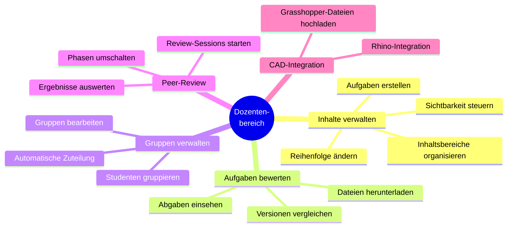
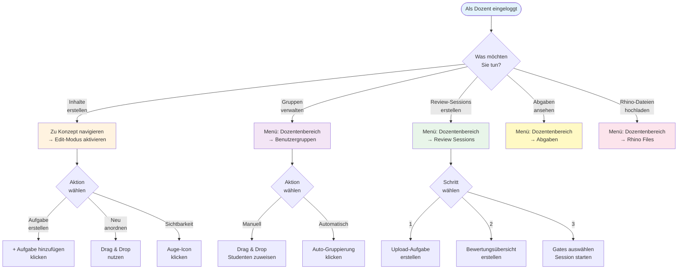

# Übersicht: Dozentenbereich im HEFL-System

**HEFL (Hybrid E-Learning Framework)**
*Benutzerhandbuch für Dozenten*

---

## Willkommen im Dozentenbereich!

Dieses Handbuch zeigt Ihnen, wie Sie das HEFL-System nutzen, um Ihre Lehrveranstaltungen zu organisieren, Aufgaben zu erstellen, Studenten in Gruppen einzuteilen und Peer-Review-Prozesse zu steuern.

---

## Was können Sie als Dozent tun?



---

## Die wichtigsten Funktionen im Überblick

### 1. 📚 Inhalte verwalten

**Was können Sie tun?**
- Aufgaben erstellen (11 verschiedene Typen)
- Inhaltsbereiche organisieren
- Inhalte per Drag & Drop neu anordnen
- Sichtbarkeit für Studenten steuern

**Wo finde ich das?**
- Navigieren Sie zu einem Lernkonzept
- Aktivieren Sie den "Edit-Modus" (Schalter oben rechts)

**Mehr erfahren:** → [Inhalte verwalten](01-inhalte-verwalten.md)

---

### 2. 👥 Studentengruppen verwalten

**Was können Sie tun?**
- Studenten in Gruppen einteilen
- Gruppen manuell oder automatisch erstellen
- Gruppengrößen festlegen
- Studenten per Drag & Drop zuweisen

**Wo finde ich das?**
- Menü: **Dozentenbereich → Benutzergruppen**
- Route: `/lecturer/management/grouping`

**Wofür brauche ich Gruppen?**
- Peer-Review-Prozesse organisieren
- Projektteams bilden
- Lab-Gruppen zuweisen

**Mehr erfahren:** → [Studentengruppen verwalten](03-studentengruppen-verwalten.md)

---

### 3. 🔄 Peer-Review einrichten

**Was können Sie tun?**
- Studenten bewerten gegenseitig ihre Arbeiten
- Bewertungskategorien definieren
- Review-Sessions starten
- Phasen umschalten (Diskussion → Bewertung)

**Wo finde ich das?**
- Menü: **Dozentenbereich → Review Sessions**
- Route: `/lecturer/management/group-review-sessions`

**Workflow:**
```
Upload-Aufgabe → Bewertungsübersicht → Review-Session → Studenten bewerten
```

**Mehr erfahren:** → [Peer-Review einrichten](04-peer-review-einrichten.md)

---

### 4. 📥 Abgaben einsehen

**Was können Sie tun?**
- Hochgeladene Dateien von Studenten ansehen
- Dateien herunterladen
- Nach Studenten, Aufgaben oder Datum filtern
- Abgabestatus überprüfen (Wer hat abgegeben?)

**Wo finde ich das?**
- Menü: **Dozentenbereich → Abgaben**
- Route: `/lecturer/grading/uploads`

**Mehr erfahren:** → [Abgaben einsehen](05-abgaben-einsehen.md)

---

### 5. 🏗️ CAD-Integration (Rhino/Grasshopper)

**Was können Sie tun?**
- Grasshopper-Dateien (.gh) hochladen
- Dateien mit Lernkonzepten verknüpfen
- Studenten können Rhino direkt aus dem Browser starten

**Wo finde ich das?**
- Menü: **Dozentenbereich → Rhino Files**
- Route: `/lecturer/management/concept-rhino-files`

**Anwendungsfall:**
- Architekturkurse mit CAD-Modellierung
- 3D-Visualisierungen

**Mehr erfahren:** → [CAD-Integration](06-cad-integration-rhino.md)

---

## Navigation: Wo finde ich was?



---

## Die 11 Aufgabentypen im Überblick

| Typ | Symbol | Wann verwenden? | Mehr Infos |
|-----|--------|-----------------|------------|
| **Multiple Choice** | ☑️ | Wissensabfrage, Verständnistests | [Details](02-aufgabentypen-erstellen.md#31-multiple-choice) |
| **Programmieraufgabe** | 💻 | Code schreiben, Algorithmen | [Details](02-aufgabentypen-erstellen.md#32-programmieraufgaben) |
| **Code Game** | 🎮 | Visuelle Programmierung | [Details](02-aufgabentypen-erstellen.md#33-code-game) |
| **Lückentext** | 📝 | Begriffe einsetzen | [Details](02-aufgabentypen-erstellen.md#34-lückentext) |
| **Freitext** | ✍️ | Essay, offene Fragen | [Details](02-aufgabentypen-erstellen.md#35-freitext) |
| **Graph-Aufgaben** | 🔗 | Algorithmen (Dijkstra, Kruskal) | [Details](02-aufgabentypen-erstellen.md#36-graph-aufgaben) |
| **UML-Diagramme** | 📊 | Softwaredesign | [Details](02-aufgabentypen-erstellen.md#37-uml-diagramme) |
| **Datei-Upload** | 📤 | Dateien einreichen (PDF, Code, etc.) | [Details](02-aufgabentypen-erstellen.md#38-datei-upload) |
| **Bewertungsübersicht** | 🔄 | Peer-Review starten | [Details](04-peer-review-einrichten.md) |
| **Fragensammlung** | 📚 | Mehrere Fragen bündeln | [Details](02-aufgabentypen-erstellen.md#310-fragensammlung) |

---

## Erste Schritte nach dem Login

### Schritt 1: Orientierung
1. Loggen Sie sich mit Ihren Dozenten-Zugangsdaten ein
2. Klicken Sie auf das **Menü** (☰) oben links
3. Wählen Sie **"Dozentenbereich"**

### Schritt 2: Lernkonzept auswählen
1. Navigieren Sie zu einem vorhandenen Lernkonzept
   - z.B. "Objektorientierte Programmierung"
2. Aktivieren Sie den **Edit-Modus** (Schalter oben rechts)
3. Jetzt können Sie Inhalte bearbeiten!

### Schritt 3: Erste Aufgabe erstellen
1. Klicken Sie auf **"+ Aufgabe hinzufügen"**
2. Wählen Sie einen Aufgabentyp (z.B. Multiple Choice)
3. Füllen Sie die Felder aus:
   - Titel
   - Aufgabentext
   - Schwierigkeit (Level 1-5)
   - Punkte
4. Speichern Sie die Aufgabe

### Schritt 4: Studenten informieren
- Die Aufgabe ist jetzt für Studenten sichtbar
- Sie können die Sichtbarkeit später ändern (Auge-Icon)

---

## Häufig gestellte Fragen

### Kann ich Aufgaben wiederverwenden?
Ja! Beim Erstellen einer Aufgabe können Sie zwischen zwei Optionen wählen:
- **"Neue Aufgabe erstellen"** - Komplett neu
- **"Vorhandene Aufgabe verknüpfen"** - Bestehende Aufgabe wiederverwenden

### Was sehen Studenten, wenn ich im Edit-Modus bin?
Studenten sehen die normale Ansicht. Ihre Änderungen sind erst nach dem Speichern sichtbar.

### Kann ich Änderungen rückgängig machen?
- **Vor dem Speichern:** Ja, einfach Seite neu laden
- **Nach dem Speichern:** Nein, aber Sie können Inhalte bearbeiten oder löschen

### Wie viele Studenten können in einer Gruppe sein?
Sie legen die maximale Gruppengröße selbst fest (empfohlen: 4-5 Personen für Peer-Review).

---

## Support und weitere Hilfe

### Weitere Dokumentation
- [Inhalte verwalten](01-inhalte-verwalten.md) - Aufgaben und Inhaltsbereiche
- [Aufgabentypen](02-aufgabentypen-erstellen.md) - Die 11 Fragetypen im Detail
- [Studentengruppen](03-studentengruppen-verwalten.md) - Gruppen erstellen
- [Peer-Review](04-peer-review-einrichten.md) - Review-Prozesse
- [Abgaben](05-abgaben-einsehen.md) - Einreichungen verwalten
- [CAD-Integration](06-cad-integration-rhino.md) - Rhino/Grasshopper
- [FAQ](07-haeufige-fragen.md) - Häufig gestellte Fragen
- [Best Practices](08-best-practices.md) - Tipps für effektive Kurse
- [Glossar](09-glossar.md) - Begriffserklärungen

### Technischer Support
Bei technischen Problemen wenden Sie sich an:
- **IT-Support:** support@university.edu
- **Systemadministrator:** admin@hefl-system.de

---

## Glossar (Kurzversion)

| Begriff | Bedeutung |
|---------|-----------|
| **Konzept** | Übergeordnetes Lernthema (z.B. "OOP") |
| **Inhaltsbereich** | Abschnitt innerhalb eines Konzepts (z.B. "Übungen") |
| **Aufgabe** | Einzelne Lernaktivität |
| **Edit-Modus** | Bearbeitungs-Ansicht für Dozenten |
| **Bewertungsübersicht** | Startpunkt für Peer-Review |
| **Review-Session** | Aktive Peer-Review-Runde |
| **Gruppe** | Zusammenfassung von Studenten |

**Vollständiges Glossar:** → [09-glossar.md](09-glossar.md)

---

**Viel Erfolg beim Einsatz des HEFL-Systems!** 🎓

*Letzte Aktualisierung: Oktober 2024*
