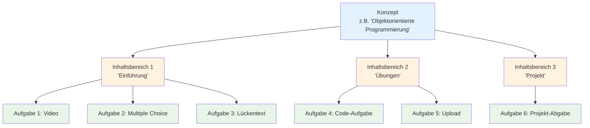
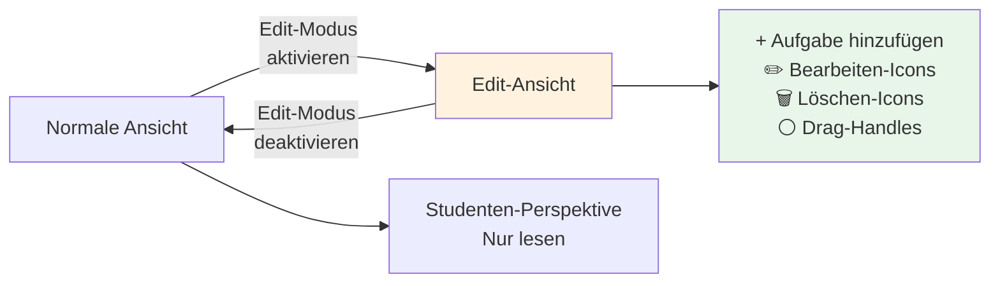
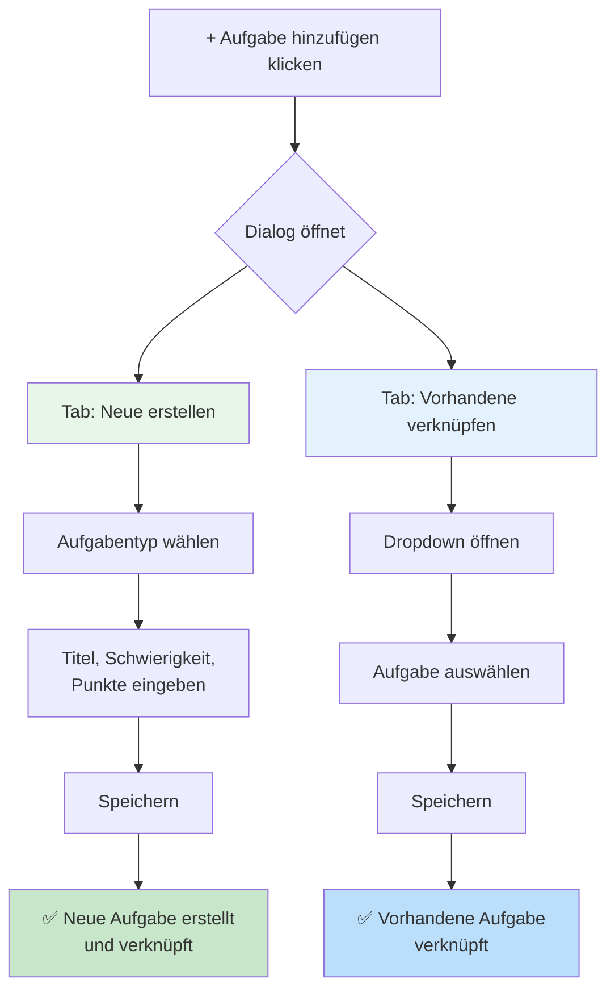
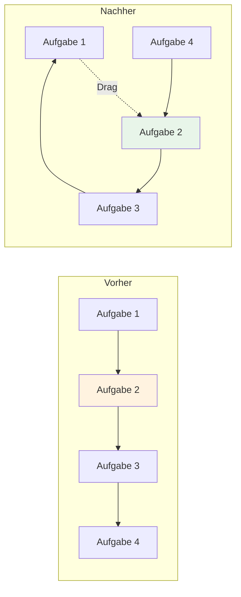
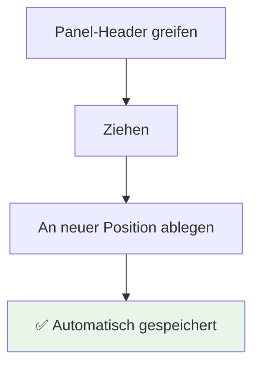
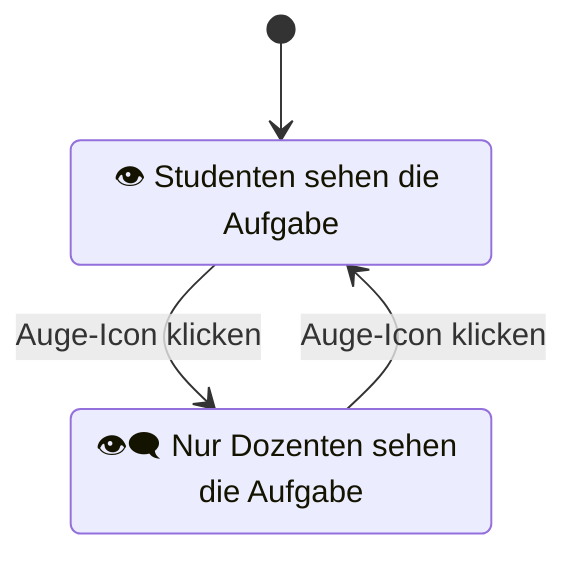
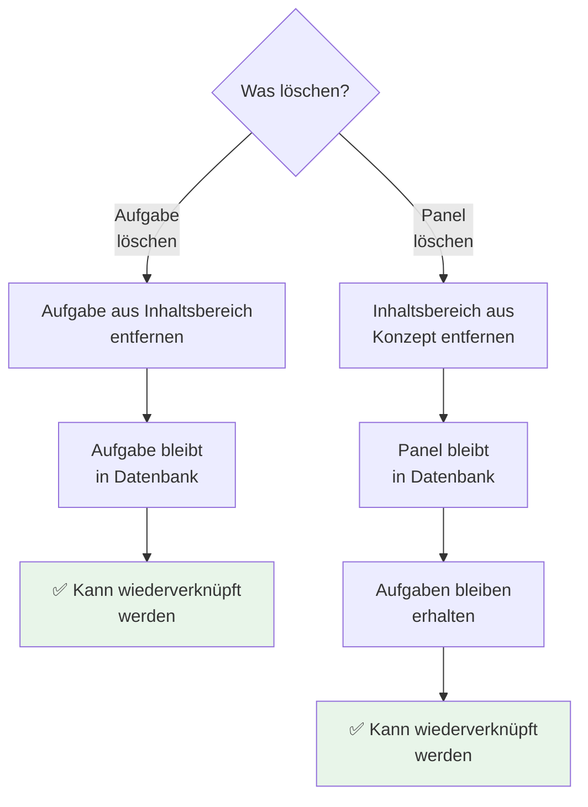
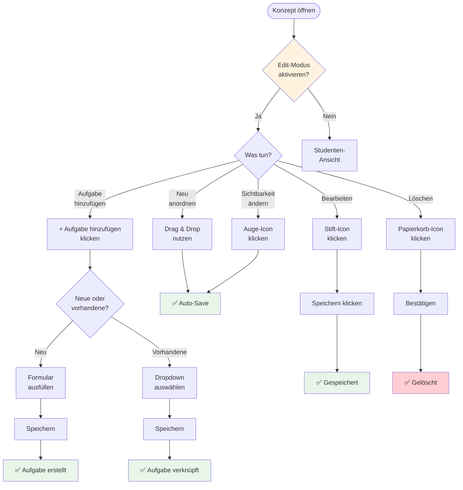

# Inhalte verwalten

**Wie Sie Lehrinhalte erstellen, organisieren und verwalten**

---

## Inhaltsverzeichnis

1. [Übersicht: Was ist Content-Management?](#übersicht)
2. [Edit-Modus aktivieren](#edit-modus-aktivieren)
3. [Neuen Inhaltsbereich erstellen](#neuen-inhaltsbereich-erstellen)
4. [Aufgabe hinzufügen](#aufgabe-hinzufügen)
5. [Inhalte neu anordnen](#inhalte-neu-anordnen)
6. [Sichtbarkeit steuern](#sichtbarkeit-steuern)
7. [Inhalte bearbeiten](#inhalte-bearbeiten)
8. [Inhalte löschen](#inhalte-löschen)

---

## Übersicht

### Was ist Content-Management?

Im HEFL-System organisieren Sie Ihre Lehrinhalte in einer **3-stufigen Hierarchie**:



**Ebene 1: Konzept** (wird vom Admin erstellt)
- Übergeordnetes Lernthema
- Beispiele: "Objektorientierte Programmierung", "Datenstrukturen", "CAD-Modellierung"

**Ebene 2: Inhaltsbereich** (Sie erstellen diese)
- Thematische Abschnitte innerhalb eines Konzepts
- Beispiele: "Einführung", "Übungen", "Vertiefung", "Projekt"
- Entspricht oft einer Woche oder einem Kapitel

**Ebene 3: Aufgaben** (Sie erstellen diese)
- Einzelne Lernaktivitäten
- Beispiele: Multiple Choice, Code-Aufgaben, Uploads, Videos

---

## Edit-Modus aktivieren

### Wo finde ich den Edit-Modus?

1. Navigieren Sie zu einem **Lernkonzept**
   - Beispiel-URL: `/concept/objektorientierte-programmierung`
2. Oben rechts sehen Sie einen **Schalter** mit "Edit-Modus"
3. Klicken Sie auf den Schalter

### Was ändert sich?



**Im Edit-Modus sehen Sie:**
- ➕ **"+ Aufgabe hinzufügen"**-Buttons
- ✏️ **Bearbeiten-Icons** (Stift) auf Inhaltsbereichen
- 🗑️ **Löschen-Icons** (Papierkorb)
- 👁️ **Sichtbarkeits-Icons** (Auge/Durchgestrichenes Auge)
- ⚪ **Drag-Handles** für Neu-Anordnung

**Wichtig:** Studenten sehen Ihre Änderungen erst **nach dem Speichern**!

---

## Neuen Inhaltsbereich erstellen

### Was ist ein Inhaltsbereich?

Ein **Inhaltsbereich** (auch "Content Panel" oder "Content Node") ist ein Container für zusammengehörige Aufgaben.

**Beispiel-Struktur:**
```
Konzept: Software Engineering
├─ Inhaltsbereich 1: "Woche 1 - Grundlagen"
│  ├─ Video: Einführung
│  ├─ Multiple Choice: Wissenstest
│  └─ Lesetext: Weiterführende Literatur
│
├─ Inhaltsbereich 2: "Woche 2 - UML-Diagramme"
│  ├─ UML-Aufgabe: Klassendiagramm
│  └─ Upload: Eigenes Diagramm
│
└─ Inhaltsbereich 3: "Abschlussprojekt"
   └─ Upload: Projektdokumentation
```

### Schritt-für-Schritt: Inhaltsbereich erstellen

**Aktueller Status:** Diese Funktion wird über die Content-Linker-API unterstützt, ist aber möglicherweise in einer separaten Admin-Ansicht verfügbar.

**Alternative:** Wenden Sie sich an Ihren Systemadministrator, um neue Inhaltsbereiche anzulegen.

---

## Aufgabe hinzufügen

### Zwei Möglichkeiten

Wenn Sie auf **"+ Aufgabe hinzufügen"** klicken, öffnet sich ein Dialog mit zwei Optionen:



### Option 1: Neue Aufgabe erstellen

**Schritt-für-Schritt:**

1. **Aufgabentyp wählen**
   - Multiple Choice (Einfach-/Mehrfachauswahl)
   - Programmieraufgabe
   - Code Game
   - Lückentext
   - Freitext
   - Graph-Aufgaben
   - UML-Diagramm
   - Datei-Upload
   - Bewertungsübersicht (für Peer-Review)
   - Fragensammlung

   **Mehr zu Typen:** → [Aufgabentypen-Referenz](02-aufgabentypen-erstellen.md)

2. **Metadaten eingeben**
   - **Aufgabentitel:** Kurze Beschreibung (z.B. "Wissenstest OOP")
   - **Schwierigkeit:** Level 1 (Grundlagen) bis 5 (Experte)
   - **Punkte:** Maximale Punktzahl (z.B. 10)

3. **Content-Element-Informationen**
   - **Element-Titel:** Kann identisch sein
   - **Beschreibung:** Optional
   - **Position:** Wo soll die Aufgabe erscheinen? (Anfang/Ende)

4. **Speichern klicken**

**Ergebnis:**
- Aufgabe wird erstellt
- Aufgabe wird dem Inhaltsbereich hinzugefügt
- Sie werden zur Detailbearbeitung weitergeleitet

### Option 2: Vorhandene Aufgabe verknüpfen

**Wann nützlich?**
- Sie möchten dieselbe Aufgabe in mehreren Konzepten verwenden
- Sie möchten Aufgaben wiederverwenden

**Schritt-für-Schritt:**

1. **Tab "Vorhandene verknüpfen" öffnen**

2. **Dropdown-Menü öffnen**
   - Zeigt alle Aufgaben, die noch nicht verknüpft sind

3. **Aufgabe auswählen**
   - Suchfunktion nutzen
   - Nach Titel oder Typ filtern

4. **Position wählen**
   - Wo soll die Aufgabe eingefügt werden?

5. **Speichern klicken**

**Ergebnis:**
- Aufgabe erscheint im Inhaltsbereich
- Änderungen an der Aufgabe wirken sich auf ALLE Verknüpfungen aus

---

## Inhalte neu anordnen

### Aufgaben innerhalb eines Bereichs verschieben

**Per Drag & Drop:**



**Schritt-für-Schritt:**

1. **Edit-Modus aktivieren**

2. **Drag-Handle greifen**
   - Jede Aufgabe hat links ein **⚪ Drag-Handle** (sechs Punkte)

3. **Aufgabe ziehen**
   - Klicken und halten
   - An neue Position ziehen
   - Loslassen

4. **Automatisches Speichern**
   - Die neue Reihenfolge wird sofort gespeichert
   - Studenten sehen die neue Reihenfolge

**Was Studenten sehen:**
- Aufgaben erscheinen in der neuen Reihenfolge
- Keine Benachrichtigung über Änderung

### Inhaltsbereiche (Panels) verschieben

**Per Drag & Drop:**



**Schritt-für-Schritt:**

1. **Panel-Header greifen**
   - Klicken Sie auf den **Titel** des Inhaltsbereichs
   - Halten Sie die Maustaste gedrückt

2. **Ziehen**
   - Nach oben oder unten ziehen
   - Andere Panels rutschen automatisch zur Seite

3. **Ablegen**
   - Maustaste loslassen
   - Panel-Position wird gespeichert

**Tipp:** Sie können Panels nur innerhalb desselben Konzepts verschieben, nicht zwischen Konzepten.

---

## Sichtbarkeit steuern

### Warum Sichtbarkeit ändern?

**Anwendungsfälle:**
- 📅 **Inhalte zeitgesteuert freischalten** (z.B. wöchentlich)
- 🏗️ **Inhalte vorbereiten**, bevor Studenten sie sehen
- 🔒 **Veraltete Inhalte verbergen**, ohne sie zu löschen
- 🎯 **Prüfungen vorbereiten**, die erst später sichtbar werden

### Sichtbarkeit von Aufgaben



**Schritt-für-Schritt:**

1. **Edit-Modus aktivieren**

2. **Auge-Icon finden**
   - Neben jeder Aufgabe sehen Sie ein **Auge-Icon**
   - 👁️ = Sichtbar für Studenten
   - 👁️‍🗨️ = Unsichtbar (nur für Sie)

3. **Icon klicken**
   - Einmal klicken wechselt den Status
   - Änderung wird sofort gespeichert

4. **Status überprüfen**
   - Unsichtbare Aufgaben sind grau hinterlegt
   - Studenten sehen diese Aufgaben NICHT

### Sichtbarkeit von Inhaltsbereichen

**Schritt-für-Schritt:**

1. **Panel-Header finden**
   - Jeder Inhaltsbereich hat einen Titel-Balken

2. **Auge-Icon klicken**
   - Befindet sich rechts oben im Panel-Header

3. **Effekt:**
   - **Unsichtbarer Panel** = ALLE Aufgaben darin sind für Studenten unsichtbar
   - Auch wenn einzelne Aufgaben auf "sichtbar" stehen

**Wichtig:** Panel-Sichtbarkeit überschreibt Aufgaben-Sichtbarkeit!

```
Panel unsichtbar + Aufgabe sichtbar = Student sieht NICHTS
Panel sichtbar + Aufgabe unsichtbar = Student sieht Panel, aber nicht die Aufgabe
Panel sichtbar + Aufgabe sichtbar = Student sieht beides
```

---

## Inhalte bearbeiten

### Aufgabe bearbeiten

**Schritt-für-Schritt:**

1. **Aufgabe finden**
   - Im Edit-Modus

2. **Bearbeiten-Icon klicken**
   - ✏️ Stift-Icon neben der Aufgabe

3. **Editor öffnet sich**
   - Je nach Aufgabentyp unterschiedliche Editoren
   - Siehe: [Aufgabentypen-Referenz](02-aufgabentypen-erstellen.md)

4. **Änderungen vornehmen**
   - Text ändern
   - Optionen anpassen
   - Punkte ändern
   - etc.

5. **Speichern**
   - **"Speichern (aktualisieren)"** = Erstellt neue Version
   - Alte Version bleibt erhalten (Versionierung)

### Inhaltsbereich bearbeiten

**Schritt-für-Schritt:**

1. **Panel-Header finden**

2. **Bearbeiten-Icon klicken**
   - ✏️ Stift-Icon im Panel-Header

3. **Dialog öffnet sich**
   - **Name:** Titel des Inhaltsbereichs
   - **Beschreibung:** Optionale Beschreibung
   - **Level:** Schwierigkeit (1-5)

4. **Speichern klicken**

**Ergebnis:**
- Panel-Titel ändert sich sofort
- Studenten sehen die neue Bezeichnung

---

## Inhalte löschen

### ⚠️ Wichtig: Was passiert beim Löschen?



**Gute Nachricht:**
- Löschen entfernt nur die **Verknüpfung**
- Die Aufgabe/der Panel selbst bleibt erhalten
- Sie können sie später wiederverwenden

**Schlechte Nachricht:**
- Studenten sehen die Aufgabe sofort nicht mehr
- Keine Warnung, wenn Studenten bereits bearbeitet haben

### Aufgabe löschen

**Schritt-für-Schritt:**

1. **Edit-Modus aktivieren**

2. **Löschen-Icon klicken**
   - 🗑️ Papierkorb-Icon neben der Aufgabe

3. **Bestätigung**
   - Dialog: "Möchten Sie diese Verknüpfung wirklich entfernen?"
   - **Ja** = Aufgabe verschwindet aus diesem Inhaltsbereich
   - **Nein** = Abbrechen

4. **Ergebnis:**
   - Aufgabe ist nicht mehr sichtbar (auch nicht für Studenten)
   - Aufgabe kann über "Vorhandene verknüpfen" wiederhergestellt werden

### Inhaltsbereich löschen

**Schritt-für-Schritt:**

1. **Panel-Header finden**

2. **Löschen-Icon klicken**
   - 🗑️ Papierkorb-Icon im Panel-Header

3. **Bestätigung**
   - Warnung: "Link wird entfernt, Inhalte bleiben erhalten"

4. **Ergebnis:**
   - Panel verschwindet aus dem Konzept
   - Alle Aufgaben darin sind für Studenten unsichtbar
   - Panel kann von Admin wiederverknüpft werden

---

## Zusammenfassung: Workflow-Übersicht



---

## Tipps und Best Practices

### 📅 Inhalte zeitgesteuert freischalten

**Problem:** Sie wollen Inhalte wöchentlich freigeben, aber alles vorher vorbereiten.

**Lösung:**
1. Erstellen Sie alle Inhaltsbereiche im Voraus
2. Setzen Sie sie auf "unsichtbar" (👁️‍🗨️)
3. Schalten Sie jede Woche manuell sichtbar

**Tipp:** Nutzen Sie klare Namen wie "Woche 1", "Woche 2", etc.

### 🏗️ Inhalte schrittweise entwickeln

**Problem:** Sie wollen Inhalte vorbereiten, während Studenten bereits auf andere Inhalte zugreifen.

**Lösung:**
- Erstellen Sie neue Aufgaben als "unsichtbar"
- Testen Sie sie selbst (Dozenten sehen alles)
- Schalten Sie sichtbar, wenn fertig

### 🎯 Klare Struktur für Studenten

**Problem:** Studenten verlieren Überblick bei vielen Aufgaben.

**Lösung:**
- Nutzen Sie **aussagekräftige Panel-Namen**
  - ✅ "Woche 1: Grundlagen OOP"
  - ❌ "Panel 1"
- Gruppieren Sie **thematisch verwandte Aufgaben**
- Nutzen Sie **Schwierigkeitslevel konsistent**

### 🔄 Aufgaben wiederverwenden

**Problem:** Dieselbe Aufgabe soll in mehreren Kursen auftauchen.

**Lösung:**
- Erstellen Sie die Aufgabe **einmal**
- Verknüpfen Sie sie in allen relevanten Konzepten
- **Vorteil:** Änderungen wirken überall

**Achtung:** Wenn Sie die Aufgabe ändern, ändert sie sich in ALLEN Kursen!

---

## Häufige Fehler vermeiden

### ❌ Fehler 1: Aufgabe löschen statt ausblenden

**Problem:** Sie löschen eine Aufgabe, wollen sie aber später wieder nutzen.

**Lösung:** Nutzen Sie stattdessen "Unsichtbar schalten" (👁️‍🗨️)

### ❌ Fehler 2: Panel unsichtbar, Aufgaben sichtbar

**Problem:** Studenten sehen nichts, obwohl Aufgaben auf "sichtbar" stehen.

**Lösung:** Überprüfen Sie die **Panel-Sichtbarkeit**! Diese überschreibt Aufgaben-Sichtbarkeit.

### ❌ Fehler 3: Keine Versionierung nutzen

**Problem:** Sie überschreiben eine Aufgabe und verlieren die alte Version.

**Lösung:** Nutzen Sie "Speichern (neue Version)" statt "Überschreiben"

---

## Weiterführende Themen

- **Aufgabentypen im Detail:** → [02-aufgabentypen-erstellen.md](02-aufgabentypen-erstellen.md)
- **Gruppen verwalten:** → [03-studentengruppen-verwalten.md](03-studentengruppen-verwalten.md)
- **Peer-Review einrichten:** → [04-peer-review-einrichten.md](04-peer-review-einrichten.md)
- **Best Practices:** → [08-best-practices.md](08-best-practices.md)

---

*Zurück zur [Übersicht](00-uebersicht-dozentenbereich.md)*
