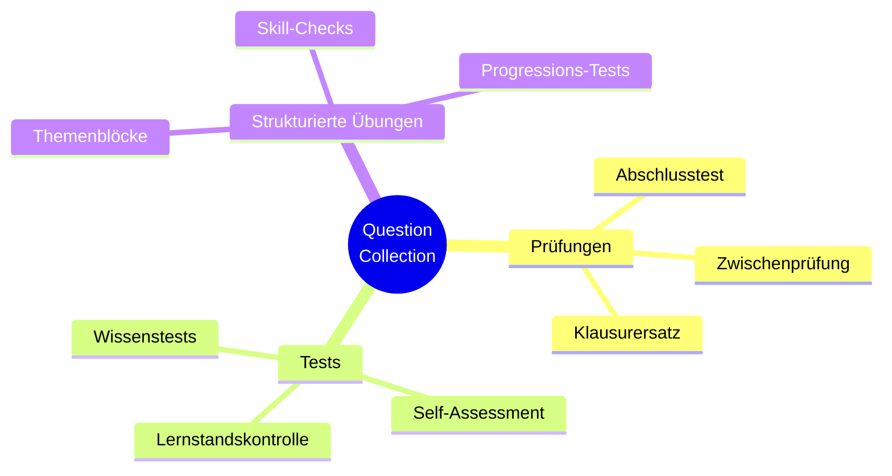
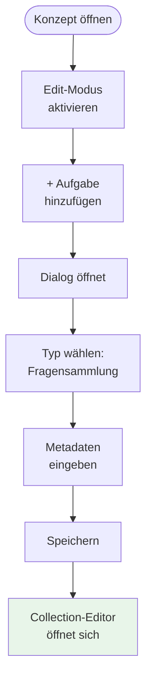
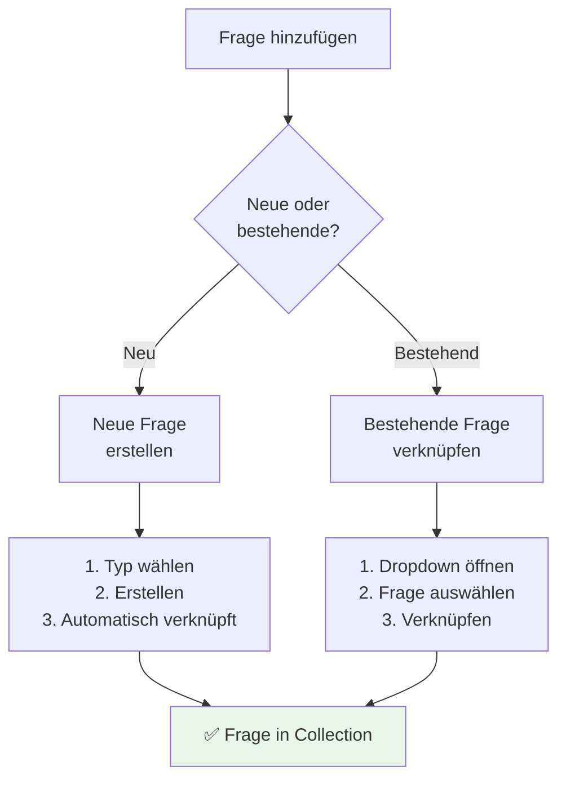
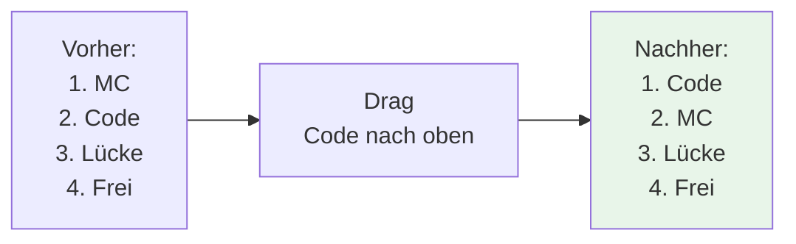
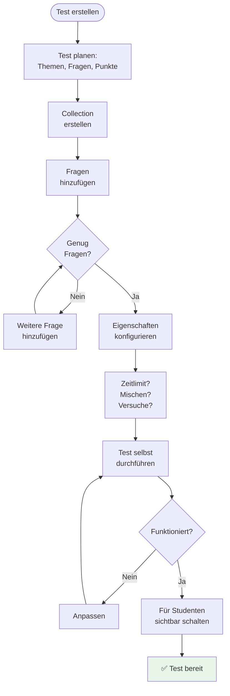

# Question Collection erstellen

**Mehrere Aufgaben zu einem Test oder einer Prüfung bündeln**

---

## Inhaltsverzeichnis

1. [Was ist eine Question Collection?](#was-ist-eine-question-collection)
2. [Wann verwenden?](#wann-verwenden)
3. [Question Collection erstellen](#question-collection-erstellen)
4. [Aufgaben hinzufügen](#aufgaben-hinzufügen)
5. [Reihenfolge festlegen](#reihenfolge-festlegen)
6. [Eigenschaften konfigurieren](#eigenschaften-konfigurieren)
7. [Was sehen Studenten?](#was-sehen-studenten)
8. [Best Practices](#best-practices)

---

## Was ist eine Question Collection?

### Konzept

Eine **Question Collection** (Fragensammlung) ist eine spezielle Aufgabe, die **mehrere andere Aufgaben bündelt**.

```mermaid
graph TD
    Collection[Question Collection:<br/>"Abschlusstest OOP"] --> Q1[Frage 1:<br/>Multiple Choice]
    Collection --> Q2[Frage 2:<br/>Programmieraufgabe]
    Collection --> Q3[Frage 3:<br/>Lückentext]
    Collection --> Q4[Frage 4:<br/>Freitext]

    style Collection fill:#e3f2fd
    style Q1 fill:#e8f5e9
    style Q2 fill:#e8f5e9
    style Q3 fill:#e8f5e9
    style Q4 fill:#e8f5e9
```

**Metapher:** Wie ein Ordner, der mehrere Dokumente enthält.

### Unterschied zu normalem Inhaltsbereich

| Inhaltsbereich (Content Panel) | Question Collection |
|--------------------------------|---------------------|
| Container für verschiedene Inhalte | Container **nur** für Aufgaben |
| Aufgaben sind einzeln bearbeitbar | Aufgaben werden **gebündelt präsentiert** |
| Studenten sehen Panel-Struktur | Studenten sehen **Test-Interface** |
| Keine zeitliche Begrenzung | **Optional:** Zeitlimit |
| Keine Gesamtpunktzahl | **Gesamtpunktzahl** wird berechnet |

**Beispiel-Struktur:**

```
Inhaltsbereich "Woche 3":
├─ Video: Einführung Vererbung
├─ Multiple Choice: Wissenstest
├─ Code-Aufgabe: Vererbung implementieren
└─ Lesetext: Weiterführende Literatur

vs.

Question Collection "Abschlusstest OOP":
├─ Frage 1: Multiple Choice (10 Punkte)
├─ Frage 2: Code-Aufgabe (20 Punkte)
├─ Frage 3: Lückentext (15 Punkte)
└─ Frage 4: Freitext (25 Punkte)
   = Gesamt: 70 Punkte
```

---

## Wann verwenden?

### Anwendungsfälle



**1. Abschlusstests/Prüfungen**
- **Zweck:** Summative Bewertung
- **Eigenschaften:**
  - Alle relevanten Themen abdecken
  - Zeitlimit (z.B. 90 Minuten)
  - Hohe Punktzahl (z.B. 100 Punkte)
  - Einmalige Bearbeitung

**2. Wissenstests**
- **Zweck:** Formative Bewertung
- **Eigenschaften:**
  - Schneller Überblick über Lernstand
  - Kein/geringes Zeitlimit
  - Mittlere Punktzahl (z.B. 30 Punkte)
  - Wiederholbar

**3. Thematische Übungsblöcke**
- **Zweck:** Strukturiertes Lernen
- **Eigenschaften:**
  - Mehrere Aufgaben zu einem Thema
  - Stufenweise Schwierigkeit
  - Feedback nach jeder Aufgabe

**4. Self-Assessment**
- **Zweck:** Selbsteinschätzung
- **Eigenschaften:**
  - Freiwillige Teilnahme
  - Sofortiges Feedback
  - Keine Note

---

## Question Collection erstellen

### Schritt-für-Schritt



**1. Konzept öffnen & Edit-Modus aktivieren**
   - Siehe: [Inhalte verwalten](01-inhalte-verwalten.md#edit-modus-aktivieren)

**2. "+" Aufgabe hinzufügen" klicken**

**3. Dialog: "Neue Aufgabe erstellen"**

```
┌─────────────────────────────────────────┐
│ Neue Aufgabe erstellen                  │
├─────────────────────────────────────────┤
│ Aufgabentyp:                            │
│ [Fragensammlung                     ▼] │
│                                         │
│ Titel:                                  │
│ [Abschlusstest OOP___________________] │
│                                         │
│ Beschreibung:                           │
│ [Dieser Test prüft Ihr Wissen über     │
│  objektorientierte Programmierung.     │
│  Bearbeitungszeit: 90 Minuten._______] │
│                                         │
│ Schwierigkeit: [Level 4            ▼] │
│ Punkte: [100] (Gesamtpunkte)            │
│                                         │
│         [Abbrechen]  [Speichern]        │
└─────────────────────────────────────────┘
```

**Wichtige Felder:**

**Titel:**
- Beschreibender Name für den Test
- Studenten sehen diesen Titel
- Beispiele:
  - "Abschlusstest Objektorientierte Programmierung"
  - "Wissenstest Woche 5"
  - "Self-Assessment Datenstrukturen"

**Beschreibung:**
- Instruktionen für Studenten
- Was wird geprüft?
- Bearbeitungszeit
- Erlaubte Hilfsmittel
- Bewertungskriterien

**Schwierigkeit:**
- Level 1-5
- Indikator für Studenten

**Punkte:**
- **Gesamtpunktzahl** der Collection
- Wird später auf enthaltene Fragen verteilt
- Beispiel: 100 Punkte Collection = 4 Fragen à 25 Punkte

**4. Speichern klicken**

**5. Collection-Editor öffnet sich:**

```
┌───────────────────────────────────────────────────┐
│ Fragensammlung bearbeiten                         │
│ "Abschlusstest OOP"                               │
├───────────────────────────────────────────────────┤
│ Enthaltene Fragen: 0                              │
│ Gesamtpunkte: 100                                 │
│                                                   │
│ [➕ Frage hinzufügen]                              │
│                                                   │
│ ┌─────────────────────────────────────────────┐   │
│ │ (Noch keine Fragen)                         │   │
│ └─────────────────────────────────────────────┘   │
│                                                   │
│ Eigenschaften:                                    │
│ ☐ Zeitlimit aktivieren: [90] Minuten             │
│ ☐ Fragen mischen (Randomisierung)                │
│ ☐ Nur 1 Versuch erlaubt                          │
│                                                   │
│         [Abbrechen]  [Speichern]                  │
└───────────────────────────────────────────────────┘
```

---

## Aufgaben hinzufügen

### Zwei Möglichkeiten

Wie bei normalem Content-Management gibt es zwei Wege:



### Option 1: Neue Frage erstellen

**Schritt-für-Schritt:**

1. **"➕ Frage hinzufügen" klicken**

2. **Dialog: "Neue Frage erstellen"**

```
┌─────────────────────────────────────────┐
│ Neue Frage erstellen                    │
├─────────────────────────────────────────┤
│ Fragentyp:                              │
│ [Multiple Choice                    ▼] │
│                                         │
│ Titel:                                  │
│ [Frage 1: Vererbung in OOP__________]  │
│                                         │
│ Punkte: [25]                            │
│                                         │
│         [Abbrechen]  [Erstellen]        │
└─────────────────────────────────────────┘
```

**Verfügbare Fragentypen:**
- ✅ Multiple Choice (Einfach-/Mehrfachauswahl)
- ✅ Programmieraufgabe
- ✅ Code Game
- ✅ Lückentext
- ✅ Freitext
- ✅ Graph-Aufgaben
- ✅ UML-Diagramm
- ❌ Datei-Upload (meist nicht in Tests)
- ❌ Bewertungsübersicht (nicht sinnvoll)

**3. Punkte verteilen:**

```
Collection: 100 Punkte gesamt
├─ Frage 1 (MC):     25 Punkte (25%)
├─ Frage 2 (Code):   30 Punkte (30%)
├─ Frage 3 (Lücke):  20 Punkte (20%)
└─ Frage 4 (Frei):   25 Punkte (25%)
   = 100 Punkte total
```

**Tipp:** Überlegen Sie vorher, wie Sie Punkte verteilen!

**4. Erstellen klicken**

**5. Frage erscheint in Liste:**

```
┌───────────────────────────────────────────────────┐
│ Enthaltene Fragen: 1                              │
│ Gesamtpunkte: 100                                 │
│                                                   │
│ ┌─────────────────────────────────────────────┐   │
│ │ ⚪ Frage 1: Vererbung in OOP           25P  │   │
│ │    Typ: Multiple Choice                     │   │
│ │    [✏️] [🗑️]                                 │   │
│ └─────────────────────────────────────────────┘   │
└───────────────────────────────────────────────────┘
```

**6. Frage bearbeiten:**
   - Klick auf **✏️** → Öffnet den spezifischen Editor (z.B. MC-Editor)
   - Siehe jeweilige Aufgabentyp-Dokumentation

### Option 2: Bestehende Frage verknüpfen

**Wann sinnvoll:**
- Sie haben Fragen in einer Fragendatenbank
- Sie wollen Fragen aus anderen Tests wiederverwenden
- Sie wollen Fragen aus Übungen in Test übernehmen

**Schritt-für-Schritt:**

1. **"➕ Frage hinzufügen" klicken**

2. **Tab "Bestehende verknüpfen" wählen**

3. **Dropdown öffnen:**
   - Zeigt alle **nicht verknüpften** Fragen
   - Gruppiert nach Typ

```
┌─────────────────────────────────────────┐
│ Bestehende Frage verknüpfen             │
├─────────────────────────────────────────┤
│ Frage auswählen:                        │
│ [Wählen Sie eine Frage...          ▼]  │
│                                         │
│ ↓ Multiple Choice (5)                   │
│   - Was ist Vererbung? (10P)            │
│   - Polymorphismus erklärt (15P)        │
│   ...                                   │
│                                         │
│ ↓ Programmieraufgaben (3)               │
│   - Implementiere Klasse Person (20P)   │
│   ...                                   │
│                                         │
│         [Abbrechen]  [Verknüpfen]       │
└─────────────────────────────────────────┘
```

4. **Frage auswählen**

5. **Verknüpfen klicken**

**Ergebnis:**
- Frage erscheint in Collection-Liste
- **Änderungen an der Frage** wirken sich auf ALLE Collections aus, die sie verwenden!

---

## Reihenfolge festlegen

### Drag & Drop

Wie bei normalen Aufgaben können Sie die Reihenfolge ändern:



**Schritt-für-Schritt:**

1. **Drag-Handle greifen**
   - Jede Frage hat ⚪ (sechs Punkte) links

2. **Frage ziehen**
   - An neue Position

3. **Ablegen**
   - Automatisch gespeichert

### Empfohlene Reihenfolge

**Pädagogische Prinzipien:**

**1. Vom Leichten zum Schweren**
```
✅ Gute Reihenfolge:
├─ 1. Multiple Choice (leicht, schnell)
├─ 2. Lückentext (mittel)
├─ 3. Code-Aufgabe (schwer)
└─ 4. Freitext (sehr schwer, zeitintensiv)

❌ Schlechte Reihenfolge:
├─ 1. Freitext (Student frustriert am Anfang)
├─ 2. Code (noch überfordert)
├─ 3. Lückentext
└─ 4. MC (zu leicht am Ende, keine Motivation)
```

**2. Nach Themenbereichen**
```
Thema 1: Vererbung
├─ Frage 1: MC zu Vererbung
├─ Frage 2: Code zu Vererbung
└─ Frage 3: Freitext zu Vererbung

Thema 2: Polymorphismus
├─ Frage 4: MC zu Polymorphismus
├─ Frage 5: Code zu Polymorphismus
└─ ...
```

**3. Nach Zeitaufwand**
```
Schnelle Fragen zuerst:
├─ 1-5: MC (je 2-3 Min)
├─ 6-8: Lückentext (je 5 Min)
├─ 9-10: Code (je 15 Min)
└─ 11: Freitext (20 Min)

Warum? Student bekommt schnell "Erfolgserlebnisse"
```

---

## Eigenschaften konfigurieren

### Zeitlimit

**Aktivieren:**
```
☑ Zeitlimit aktivieren: [90] Minuten
```

**Was passiert:**
- Timer startet beim Öffnen der Collection
- Student sieht Countdown
- Nach Ablauf: **Automatische Abgabe**
- Nicht gespeicherte Antworten gehen verloren

**Empfehlungen:**

| Test-Typ | Empfohlenes Zeitlimit |
|----------|---------------------|
| **Kurzer Wissenstest** | 15-30 Minuten |
| **Mittlerer Test** | 45-60 Minuten |
| **Abschlussprüfung** | 90-120 Minuten |
| **Übungstest** | Kein Zeitlimit (unbegrenzt) |

**Berechnung:**
```
Formel: (Anzahl Fragen × Durchschnittliche Zeit) × 1.5

Beispiel:
10 Fragen, Ø 5 Min = 50 Min
50 Min × 1.5 = 75 Min Zeitlimit

Warum 1.5? Puffer für Nachdenken, Lesen, Überprüfen
```

### Fragen mischen

**Aktivieren:**
```
☑ Fragen mischen (Randomisierung)
```

**Was passiert:**
- Jeder Student sieht Fragen in **zufälliger Reihenfolge**
- Verhindert Abschreiben bei Präsenz-Tests
- Jeder Student hat individuelle Fragenreihenfolge

**Beispiel:**

```
Student A:                Student B:
├─ Frage 3               ├─ Frage 1
├─ Frage 1               ├─ Frage 4
├─ Frage 4               ├─ Frage 2
└─ Frage 2               └─ Frage 3
```

**Wann nutzen:**
- ✅ Präsenz-Prüfungen (Studenten sitzen nebeneinander)
- ✅ Online-Prüfungen (Screenshot-Austausch verhindern)
- ❌ Tests mit logischer Reihenfolge (z.B. aufbauend)

### Versuche begrenzen

**Aktivieren:**
```
☑ Nur 1 Versuch erlaubt
```

**Was passiert:**
- Student kann Test nur **einmal** starten
- Nach Abgabe: Kein erneuter Zugriff
- Auch bei versehentlicher Abgabe keine Wiederholung

**Alternativen:**
```
☐ Unbegrenzt viele Versuche (Übungsmodus)
☑ Maximal 3 Versuche (Learning by Doing)
☑ Nur 1 Versuch (Ernstfall/Prüfung)
```

**Empfehlung:**

| Test-Typ | Versuche |
|----------|----------|
| **Selbsttest** | Unbegrenzt |
| **Übungstest** | 3 Versuche |
| **Wissenstest** | 2 Versuche |
| **Abschlussprüfung** | 1 Versuch |

---

## Was sehen Studenten?

### Collection in Aufgabenliste

```
┌────────────────────────────────────────────┐
│ Meine Aufgaben - OOP Grundlagen            │
├────────────────────────────────────────────┤
│ ✅ Einführung Video           (erledigt)   │
│ ✅ Übung 1: Klassen          (100/100 P)   │
│ 🔴 Abschlusstest OOP         (Offen) 100P  │
│    ⏱️ Zeitlimit: 90 Minuten                │
│    📊 4 Fragen, 100 Punkte                 │
│    🎲 Fragen werden gemischt               │
│    ⚠️ Nur 1 Versuch!                       │
└────────────────────────────────────────────┘
```

### Test-Interface

**Klick auf Collection → Dialog:**

```
┌─────────────────────────────────────────────────┐
│ Abschlusstest OOP                               │
├─────────────────────────────────────────────────┤
│ Dieser Test prüft Ihr Wissen über               │
│ objektorientierte Programmierung.               │
│                                                 │
│ ⏱️ Bearbeitungszeit: 90 Minuten                 │
│ 📊 Anzahl Fragen: 4                             │
│ 🎯 Gesamtpunkte: 100                            │
│ ⚠️ Nur 1 Versuch erlaubt!                       │
│                                                 │
│ Sobald Sie starten, läuft die Zeit.            │
│ Sie können den Test nicht pausieren.           │
│                                                 │
│              [Test starten]                     │
└─────────────────────────────────────────────────┘
```

**Nach Start:**

```
┌─────────────────────────────────────────────────────────┐
│ Abschlusstest OOP                    ⏱️ 89:42 verbleibend│
├─────────────────────────────────────────────────────────┤
│ Fortschritt: ██████████░░░░░░░░░░ 2/4 Fragen (50%)      │
├─────────────────────────────────────────────────────────┤
│                                                         │
│ Frage 2: Implementiere eine Klasse "Auto"         30P  │
│                                                         │
│ [Code-Editor]                                           │
│ public class Auto {                                     │
│    // Ihre Lösung hier...                               │
│ }                                                       │
│                                                         │
│ [◀ Vorherige Frage]    [Speichern]    [Nächste Frage ▶]│
│                                                         │
│ [🚨 Test abgeben]                                       │
└─────────────────────────────────────────────────────────┘
```

**Features:**
- ⏱️ **Countdown-Timer** (wenn Zeitlimit aktiv)
- 📊 **Fortschrittsbalken**
- ⬅️➡️ **Navigation** zwischen Fragen
- 💾 **Auto-Save** (Antworten werden regelmäßig gespeichert)
- 🚨 **Abgabe-Button** (finalisiert Test)

---

## Best Practices

### 📝 Test-Design

**1. Punkteverteilung**

```
❌ Schlechte Verteilung:
├─ Frage 1: 5 Punkte (zu wenig Gewicht)
├─ Frage 2: 5 Punkte
├─ Frage 3: 5 Punkte
└─ Frage 4: 85 Punkte (viel zu viel!)
   → Student scheitert, wenn Frage 4 nicht klappt

✅ Gute Verteilung:
├─ Frage 1: 20 Punkte
├─ Frage 2: 30 Punkte (schwerste Frage)
├─ Frage 3: 25 Punkte
└─ Frage 4: 25 Punkte
   → Balanced, kein Single Point of Failure
```

**2. Anzahl Fragen**

| Zeitlimit | Empfohlene Anzahl Fragen |
|-----------|-------------------------|
| 15 Min | 5-10 (MC/Lücke) |
| 30 Min | 8-15 |
| 60 Min | 10-20 (Mix) |
| 90 Min | 12-25 |

**Faustregel:** 1 MC-Frage = 2-3 Min, 1 Code-Aufgabe = 10-15 Min

**3. Schwierigkeitsmix**

```
Idealer Test (100 Punkte):
├─ 30% Leicht (Grundwissen abrufen)
├─ 50% Mittel (Anwenden, Transferieren)
└─ 20% Schwer (Problemlösung, Analyse)
```

### ⏰ Zeitmanagement

**Problem:** Studenten laufen aus der Zeit

**Lösungen:**

**1. Zeitlimit testen**
- Machen Sie den Test selbst
- Ihre Zeit × 3 = Studenten-Zeit
- Beispiel: Sie brauchen 25 Min → Zeitlimit 75 Min

**2. Zeitvorgaben pro Frage kommunizieren**
```
In Aufgabenstellung:
"Empfohlene Bearbeitungszeit:
├─ Frage 1-5: Je 5 Min (25 Min)
├─ Frage 6-8: Je 10 Min (30 Min)
└─ Frage 9-10: Je 15 Min (30 Min)
   = 85 Min (Sie haben 90 Min)
```

**3. Puffer einbauen**
```
Benötigte Zeit: 80 Min
Zeitlimit: 90 Min (+10 Min Puffer)
```

### 🎯 Feedback & Transparenz

**Vorher kommunizieren:**
- ✅ Welche Themen werden geprüft?
- ✅ Welche Aufgabentypen kommen vor?
- ✅ Wie viele Punkte pro Frage?
- ✅ Wie wird bewertet? (Bewertungsschema)
- ✅ Darf nachgeschlagen werden? (Open Book?)

**Beispiel-Ankündigung:**
```
Abschlusstest OOP am 15.11.2024

Inhalt:
- Vererbung, Polymorphismus, Abstraktion
- Interfaces vs. Abstrakte Klassen

Format:
- 4 Fragen, 100 Punkte
- 2× Multiple Choice (je 20P)
- 1× Code-Aufgabe (30P)
- 1× Freitext (30P)

Zeitlimit: 90 Minuten
Versuche: 1
Hilfsmittel: Keine (Closed Book)
```

### 🔒 Prüfungssicherheit

**Maßnahmen gegen Abschreiben:**

**1. Fragen mischen** (siehe oben)

**2. Zeitdruck**
- Zu wenig Zeit zum Googeln
- Fokus auf Anwendung statt Auswendiglernen

**3. Individuelle Fragen**
- Zahlen/Parameter randomisieren
- Beispiel: "Berechne Fläche von Rechteck 5×7" → Student A bekommt 5×7, Student B bekommt 8×3

**4. Aufgabentypen mit Transfer**
- Nicht nur Wissensabfrage
- Anwendung, Problemlösung
- Code schreiben statt nur Multiple Choice

---

## Zusammenfassung: Workflow



---

## Weiterführende Themen

- **Inhalte verwalten:** → [01-inhalte-verwalten.md](01-inhalte-verwalten.md)
- **Multiple Choice erstellen:** → Separate Dokumentation (falls vorhanden)
- **Code-Aufgaben erstellen:** → Separate Dokumentation (falls vorhanden)

---

*Zurück zur [Übersicht](00-uebersicht-dozentenbereich.md)*
