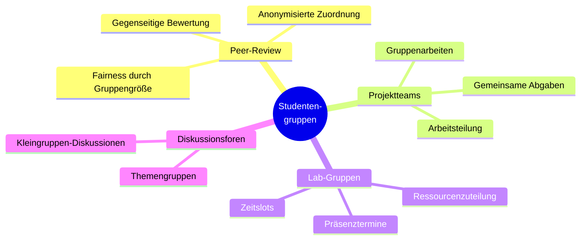
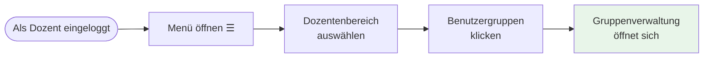
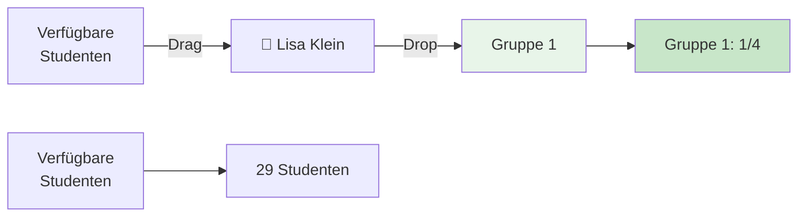
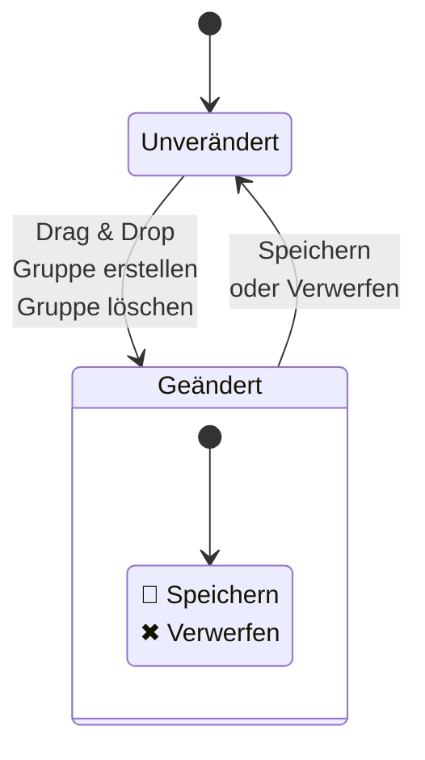
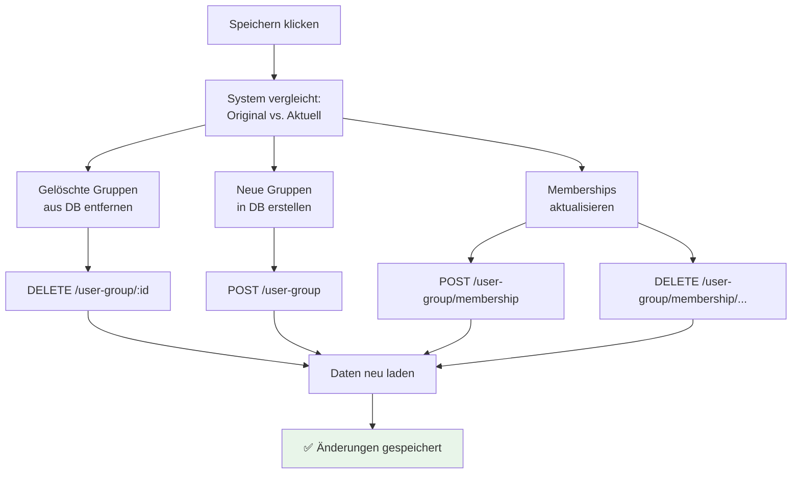
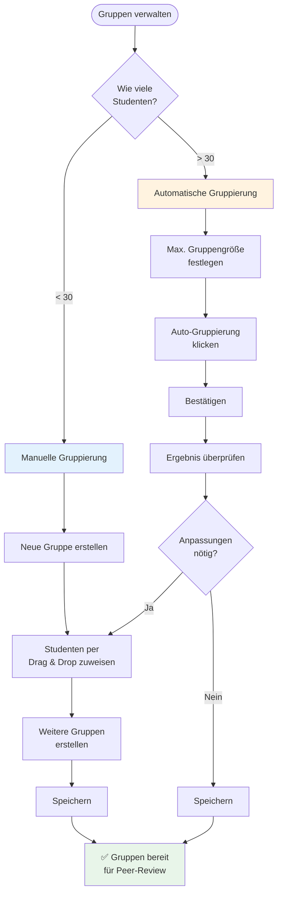

# Studentengruppen verwalten

**Gruppen erstellen und Studenten zuweisen für Peer-Review und Projektarbeit**

---

## Inhaltsverzeichnis

1. [Wofür brauche ich Gruppen?](#wofür-brauche-ich-gruppen)
2. [Zur Gruppenverwaltung navigieren](#zur-gruppenverwaltung-navigieren)
3. [Gruppen manuell erstellen](#gruppen-manuell-erstellen)
4. [Automatische Gruppierung](#automatische-gruppierung)
5. [Gruppen bearbeiten](#gruppen-bearbeiten)
6. [Gruppen löschen](#gruppen-löschen)
7. [Änderungen speichern](#änderungen-speichern)
8. [Tipps und Best Practices](#tipps-und-best-practices)

---

## Wofür brauche ich Gruppen?

### Anwendungsfälle

Studentengruppen im HEFL-System dienen verschiedenen pädagogischen Zwecken:



### Hauptanwendungsfall: Peer-Review

**Was ist Peer-Review?**
- Studenten bewerten gegenseitig ihre eingereichten Arbeiten
- Fördert kritisches Denken und Reflexion
- Entlastet Dozenten bei großen Kursen

**Warum Gruppen für Peer-Review?**
- **Skalierbarkeit:** Jeder Student bewertet nur seine Gruppenmitglieder
- **Fairness:** Gleiche Anzahl an Bewertungen pro Abgabe
- **Übersichtlichkeit:** Studenten sehen nur relevante Abgaben

**Beispiel:**
```
Kurs: 60 Studenten
Gruppengröße: 4 Studenten
Ergebnis: 15 Gruppen

Ohne Gruppen: Jeder Student müsste 59 Abgaben bewerten
Mit Gruppen: Jeder Student bewertet nur 3 Abgaben (Gruppenmitglieder)
```

---

## Zur Gruppenverwaltung navigieren

### Schritt-für-Schritt



**1. Menü öffnen**
   - Klicken Sie auf das **Hamburger-Menü** (☰) oben links

**2. Dozentenbereich auswählen**
   - Im Menü: **"Dozentenbereich"** klicken

**3. Benutzergruppen**
   - Unter "Meine Aufgaben" → **"Benutzergruppen"**

**Alternative:**
- Direkt zur Route navigieren: `/lecturer/management/grouping`

---

## Gruppen manuell erstellen

### UI-Übersicht

Die Gruppenverwaltung besteht aus **zwei Hauptbereichen**:

```
┌─────────────────────────────────────────────────────────────┐
│ Gruppenaufteilung                                           │
│ Ziehen Sie User per Drag & Drop...                         │
├─────────────────────────────────────────────────────────────┤
│                                                             │
│ [➕ Neue Gruppe]  Max. Gruppengröße: [4 ▲▼]  [⚡ Auto]      │
│                                                             │
├──────────────────────────┬──────────────────────────────────┤
│ Verfügbare Studenten     │  Gruppen                         │
│ (30%)                    │  (70%)                           │
│                          │                                  │
│ ┌──────────────────────┐ │  ┌──────┐ ┌──────┐ ┌──────┐     │
│ │ 👤 Max Müller        │ │  │ Gr 1 │ │ Gr 2 │ │ Gr 3 │     │
│ │ 👤 Anna Schmidt      │ │  │ 4/4  │ │ 3/4  │ │ 0/4  │     │
│ │ 👤 Tom Weber         │ │  └──────┘ └──────┘ └──────┘     │
│ │ ...                  │ │                                  │
│ └──────────────────────┘ │  [Hier Gruppen-Panels]           │
└──────────────────────────┴──────────────────────────────────┘
```

### Schritt 1: Neue Gruppe erstellen

```mermaid
flowchart TD
    Start[Gruppenverwaltung<br/>geöffnet] --> Click[Auf "➕ Neue Gruppe"<br/>klicken]
    Click --> Create[Leere Gruppe wird<br/>erstellt]
    Create --> Name[Automatischer Name:<br/>"Gruppe 1", "Gruppe 2", ...]
    Name --> Ready[✅ Gruppe bereit<br/>für Studenten]

    style Ready fill:#e8f5e9
```

**Was passiert:**
- Neue Gruppe erscheint rechts im Gruppen-Bereich
- Automatischer Name: "Gruppe 1", "Gruppe 2", etc.
- Gruppe ist zunächst leer (0/4 Mitglieder)
- Maximale Größe entspricht der globalen Einstellung

### Schritt 2: Studenten per Drag & Drop zuweisen

**Drag & Drop Workflow:**



**Schritt-für-Schritt:**

1. **Student auswählen**
   - Linke Seite: "Verfügbare Studenten"
   - Klicken Sie auf einen Studenten-Namen

2. **Student greifen**
   - Halten Sie die Maustaste gedrückt

3. **Zu Gruppe ziehen**
   - Ziehen Sie den Studenten nach rechts zur gewünschten Gruppe
   - Gruppe wird hervorgehoben (visuelle Feedback)

4. **Student ablegen**
   - Maustaste loslassen innerhalb der Gruppe
   - Student erscheint in der Gruppe

5. **Bestätigung**
   - Gruppen-Zähler aktualisiert sich: "1/4", "2/4", etc.
   - Student verschwindet aus "Verfügbare Studenten"

**Tipp:** Sie können Studenten auch **zwischen Gruppen** verschieben!

### Studenten zwischen Gruppen verschieben

**Beispiel-Szenario:**
```
Vorher:
├─ Gruppe 1: Lisa, Jan, Sara, Tim (4/4) - VOLL
├─ Gruppe 2: Paul, Eva, Finn (3/4)
└─ Verfügbar: Nina

Nachher (Tim von Gruppe 1 zu Gruppe 2 verschoben):
├─ Gruppe 1: Lisa, Jan, Sara (3/4)
├─ Gruppe 2: Paul, Eva, Finn, Tim (4/4) - VOLL
└─ Verfügbar: Nina
```

**Schritt-für-Schritt:**
1. Student in Quell-Gruppe anklicken
2. Zu Ziel-Gruppe ziehen
3. Ablegen
4. Beide Gruppen aktualisieren sich

### Studenten aus Gruppe entfernen

**Zurück zu "Verfügbare Studenten":**

1. Student in Gruppe anklicken
2. Nach links zu "Verfügbare Studenten" ziehen
3. Ablegen
4. Student ist wieder unzugeteilt

---

## Automatische Gruppierung

### Wann nutzen?

**Vorteile der Auto-Gruppierung:**
- ⚡ **Schnell:** Alle Studenten in Sekunden gruppiert
- 🎲 **Fair:** Zufällige Verteilung
- ⚖️ **Gleichmäßig:** Optimale Gruppengrößen

**Anwendungsfälle:**
- Große Kurse (50+ Studenten)
- Keine spezifischen Team-Anforderungen
- Peer-Review-Gruppen

### Schritt-für-Schritt

```mermaid
flowchart TD
    Start[Gruppenverwaltung<br/>geöffnet] --> Size[Maximale Gruppengröße<br/>festlegen]
    Size --> Input[Zahl eingeben<br/>z.B. 4]
    Input --> Click[Auf "⚡ Auto-Gruppierung"<br/>klicken]
    Click --> Confirm{Bestätigung:<br/>Vorhandene Gruppen<br/>werden überschrieben}
    Confirm -->|Ja| Shuffle[System verteilt<br/>ALLE Studenten zufällig]
    Confirm -->|Nein| Cancel[Abbrechen]
    Shuffle --> Result[✅ Gruppen erstellt]
    Result --> Review[Ergebnis überprüfen]
    Review --> Save[Speichern]

    style Result fill:#e8f5e9
    style Save fill:#c8e6c9
```

**1. Maximale Gruppengröße festlegen**
   - Oben rechts: "Max. Gruppengröße: [4 ▲▼]"
   - Nutzen Sie die Pfeile oder geben Sie Zahl direkt ein
   - **Empfohlen für Peer-Review:** 4-5 Studenten

**2. Auto-Gruppierung starten**
   - Klicken Sie auf **"⚡ Auto-Gruppierung"**

**3. Bestätigung**
   - ⚠️ **Warnung:** "Bestehende Gruppen werden aufgelöst"
   - **Ja** = Fortsetz en
   - **Nein** = Abbrechen

**4. Algorithmus läuft:**
   - System erstellt optimale Anzahl Gruppen
   - Verteilt ALLE Studenten zufällig
   - Versucht gleichmäßige Größen

**5. Ergebnis überprüfen:**
   - Neue Gruppen erscheinen rechts
   - "Verfügbare Studenten" ist leer (alle zugeteilt)

### Beispiel-Berechnung

**Szenario:** 47 Studenten, Max. Gruppengröße: 5

```
Berechnung:
47 Studenten ÷ 5 = 9,4
→ 9 Gruppen à 5 Studenten = 45 Studenten
→ 2 Studenten übrig

Ergebnis:
├─ 7 Gruppen mit 5 Studenten (35 Studenten)
├─ 2 Gruppen mit 6 Studenten (12 Studenten) ← Overflow verteilt
└─ Gesamt: 9 Gruppen, 47 Studenten
```

**Algorithmus-Logik:**
- Versucht maximale Gruppengröße einzuhalten
- Verteilt "Overflow" gleichmäßig (statt eine riesige Gruppe)
- Keine Gruppe bleibt leer

---

## Gruppen bearbeiten

### Gruppennamen ändern

**Aktueller Status:** Automatische Namensvergabe ("Gruppe 1", "Gruppe 2", ...)

**Workaround für aussagekräftige Namen:**
- Nutzen Sie die Gruppen-Position als Kennung
- Dokumentieren Sie extern (z.B. "Gruppe 1 = Team Alpha")
- Feature-Request: Manuelle Umbenennung wird geplant

### Gruppengröße ändern

**Zwei Wege:**

**Option 1: Manuell Studenten hinzufügen/entfernen**
- Drag & Drop wie oben beschrieben
- Keine Größenbeschränkung beim manuellen Hinzufügen

**Option 2: Globale Größe anpassen + Auto-Gruppierung**
- Maximalgröße ändern
- Erneut Auto-Gruppierung durchführen
- ⚠️ Überschreibt bestehende Gruppen!

---

## Gruppen löschen

### Einzelne Gruppe löschen

```mermaid
flowchart TD
    Start[Gruppe identifizieren] --> Trash[🗑️ Papierkorb-Icon<br/>klicken]
    Trash --> Confirm{Bestätigung}
    Confirm -->|Ja| Delete[Gruppe wird gelöscht]
    Confirm -->|Nein| Cancel[Abbrechen]
    Delete --> Students[Alle Studenten<br/>werden "verfügbar"]
    Students --> Done[✅ Gruppe entfernt]

    style Done fill:#e8f5e9
```

**Schritt-für-Schritt:**

1. **Papierkorb-Icon finden**
   - Jede Gruppe hat rechts oben ein **🗑️ Papierkorb-Icon**

2. **Icon klicken**

3. **Bestätigung**
   - Dialog: "Möchten Sie diese Gruppe wirklich löschen?"
   - **Ja** = Gruppe löschen
   - **Nein** = Abbrechen

4. **Effekt:**
   - Gruppe verschwindet
   - Alle Mitglieder gehen zurück zu "Verfügbare Studenten"
   - Änderung ist zunächst **nur lokal** (erst beim Speichern permanent)

### Alle Gruppen löschen

**Schnellster Weg:**
1. Stellen Sie Max. Gruppengröße auf eine sehr hohe Zahl (z.B. 999)
2. Klicken Sie "Auto-Gruppierung"
3. Ergebnis: Eine einzige Gruppe mit allen Studenten
4. Diese Gruppe löschen
5. Alle Studenten sind wieder verfügbar

---

## Änderungen speichern

### Wann erscheint der Speichern-Button?



**System erkennt Änderungen automatisch:**
- ✅ Student wurde verschoben
- ✅ Gruppe wurde erstellt
- ✅ Gruppe wurde gelöscht
- ✅ Auto-Gruppierung durchgeführt

**Floating Action Buttons erscheinen:**
- 💾 **Speichern** - Änderungen übernehmen
- ✖ **Verwerfen** - Zurück zum Originalzustand

### Was passiert beim Speichern?



**Backend-Operationen:**

1. **Gruppen löschen:**
   - Gruppen, die im Original waren, jetzt aber nicht → DELETE API-Call

2. **Gruppen erstellen:**
   - Neue Gruppen → POST API-Call

3. **Memberships erstellen:**
   - Für jeden neuen Studenten in Gruppe → POST membership

4. **Memberships löschen:**
   - Für jeden entfernten Studenten → DELETE membership

5. **Reload:**
   - System lädt Daten neu von Server
   - Zeigt aktuellen Stand
   - Floating Buttons verschwinden

### Änderungen verwerfen

**Was passiert:**
- Seite wird neu geladen
- Alle Änderungen gehen verloren
- Ursprünglicher Zustand wird wiederhergestellt

**Wann nutzen:**
- Sie haben Fehler gemacht
- Sie wollen von vorne beginnen
- Sie wollen Änderungen testen, ohne zu committen

---

## Tipps und Best Practices

### 📊 Optimale Gruppengröße

**Für Peer-Review:**
```
Zu klein (2-3 Studenten):
❌ Zu wenige Perspektiven
❌ Einzelner Ausfall problematisch

Optimal (4-5 Studenten):
✅ Vielfältige Feedbacks
✅ Ausfall verkraftbar
✅ Überschaubare Arbeitslast

Zu groß (6+ Studenten):
❌ Zu viele Abgaben zu bewerten
❌ Ungleichgewicht bei Ausfällen
```

**Empfehlung:** 4 Studenten pro Gruppe

### 🎲 Wann manuelle vs. automatische Gruppierung?

| Kriterium | Manuelle Gruppierung | Auto-Gruppierung |
|-----------|---------------------|------------------|
| **Kursgröße** | < 30 Studenten | > 30 Studenten |
| **Anforderung** | Spezifische Teams | Zufällige Verteilung |
| **Zeitaufwand** | Höher | Sehr gering |
| **Kontrolle** | Vollständig | Keine |
| **Use Case** | Projektteams, feste Partner | Peer-Review, faire Verteilung |

### 🔄 Gruppen während des Semesters anpassen

**Szenario:** Student tritt bei oder verlässt Kurs

**Lösung:**
1. Edit-Modus aktivieren (Gruppen öffnen)
2. Student zur passenden Gruppe hinzufügen/entfernen
3. Speichern

**Was passiert mit laufenden Peer-Reviews?**
- ⚠️ **Achtung:** Bestehende Review-Sessions bleiben unverändert
- Nur **neue Sessions** nutzen die neuen Gruppen
- Empfehlung: Gruppen VOR dem ersten Peer-Review finalisieren

### 📋 Gruppen dokumentieren

**Problem:** "Gruppe 1" sagt nichts aus

**Lösung:**
- Exportieren Sie die Gruppenliste (Screenshot oder manuell notieren)
- Vergeben Sie interne Namen (z.B. "Gruppe 1 = Red Team")
- Kommunizieren Sie Gruppennamen an Studenten (extern per Mail/Forum)

**Beispiel-Dokumentation:**
```
Peer-Review-Gruppen Wintersemester 2024
═══════════════════════════════════════

Gruppe 1 - "Red Team"
├─ Lisa Klein
├─ Jan Groß
├─ Sara Braun
└─ Tim Neu

Gruppe 2 - "Blue Team"
├─ Paul Becker
├─ Eva Lang
├─ Finn Kurz
└─ Nina Alt

...
```

### ⚖️ Ungleiche Gruppen vermeiden

**Problem:** Nach Auto-Gruppierung haben manche Gruppen 4, andere 6 Studenten

**Analyse:**
```
47 Studenten, Max. 5
→ 9 Gruppen
→ Idealerweise: 5×9 = 45, aber 47 ≠ 45
→ Overflow: 2 Studenten
```

**Lösung 1: Manuelle Nachbearbeitung**
- Auto-Gruppierung durchführen
- Größere Gruppen manuell splitten
- Studenten umverteilen

**Lösung 2: Gruppengröße anpassen**
- Berechnen Sie vorab: `Studenten ÷ Gewünschte Gruppengröße`
- Wählen Sie Größe, die gleichmäßig aufgeht
- Beispiel: 48 Studenten ÷ 4 = 12 Gruppen (perfekt)

---

## Häufige Fehler vermeiden

### ❌ Fehler 1: Speichern vergessen

**Problem:** Änderungen gemacht, aber nicht gespeichert → Seite verlassen → Alles weg

**Lösung:**
- Achten Sie auf die Floating Action Buttons
- Speichern Sie regelmäßig
- Bei Unsicherheit: Speichern, dann weiterarbeiten

### ❌ Fehler 2: Auto-Gruppierung überschreibt bestehende Arbeit

**Problem:** Sie haben Gruppen manuell erstellt, klicken versehentlich "Auto-Gruppierung"

**Lösung:**
- Lesen Sie die Warnung: "Bestehende Gruppen werden aufgelöst"
- Klicken Sie "Nein" wenn unsicher
- Falls passiert: "Verwerfen" klicken, statt zu speichern

### ❌ Fehler 3: Gruppen erst nach Peer-Review-Start erstellen

**Problem:** Review-Session wurde ohne Gruppen gestartet → Chaos

**Lösung:**
- **Reihenfolge beachten:**
  1. Gruppen erstellen
  2. Upload-Aufgabe erstellen
  3. Studenten laden hoch
  4. Review-Session starten

### ❌ Fehler 4: Einzelner Student übrig

**Problem:** 21 Studenten, Gruppengröße 4 → 5 Gruppen à 4 + 1 Student allein

**Lösung:**
- **Option A:** Gruppengröße auf 3 setzen (7 Gruppen, alle 3 Studenten)
- **Option B:** Manuell anpassen: 1 Gruppe mit 5, Rest mit 4
- **Option C:** Student zu kleinster Gruppe hinzufügen (manuell)

---

## Zusammenfassung: Workflow-Übersicht



---

## Weiterführende Themen

- **Peer-Review einrichten:** → [04-peer-review-einrichten.md](04-peer-review-einrichten.md)
- **Inhalte verwalten:** → [01-inhalte-verwalten.md](01-inhalte-verwalten.md)
- **Best Practices:** → [08-best-practices.md](08-best-practices.md)

---

*Zurück zur [Übersicht](00-uebersicht-dozentenbereich.md)*
