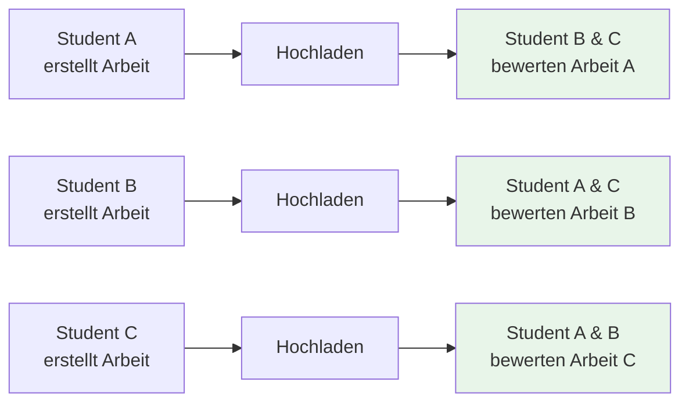
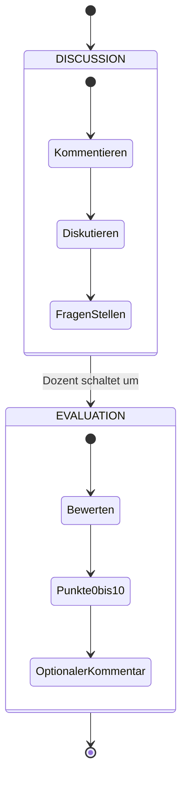
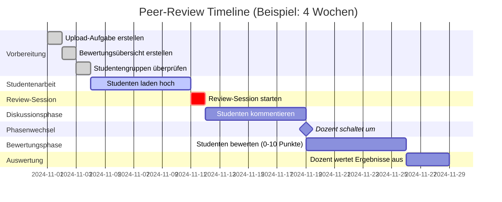
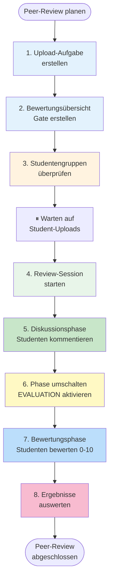
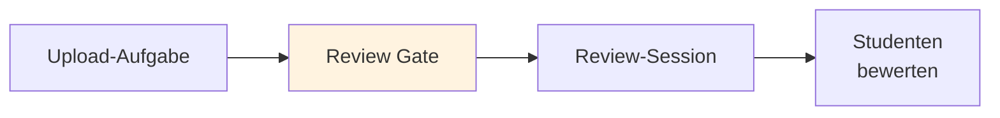
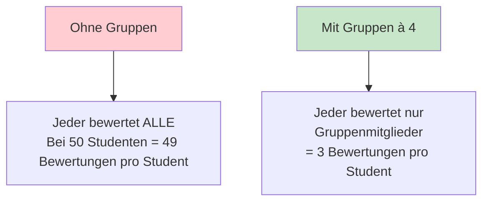
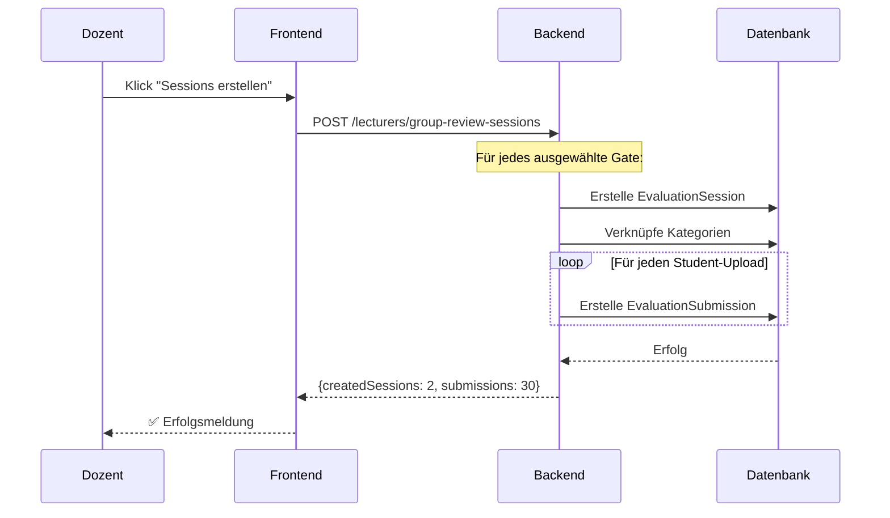
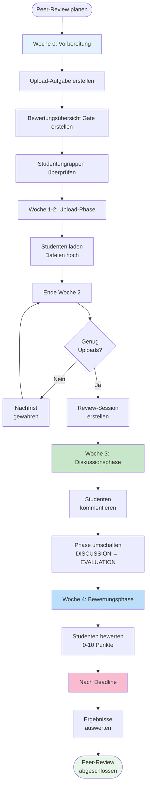

# Peer-Review einrichten

**Studenten bewerten gegenseitig ihre Arbeiten - Kompletter Workflow**

---

## Inhaltsverzeichnis

1. [Was ist Peer-Review?](#was-ist-peer-review)
2. [Gesamtablauf im Überblick](#gesamtablauf-im-überblick)
3. [Schritt 1: Upload-Aufgabe erstellen](#schritt-1-upload-aufgabe-erstellen)
4. [Schritt 2: Bewertungsübersicht (Gate) erstellen](#schritt-2-bewertungsübersicht-gate-erstellen)
5. [Schritt 3: Studentengruppen überprüfen](#schritt-3-studentengruppen-überprüfen)
6. [Schritt 4: Review-Session starten](#schritt-4-review-session-starten)
7. [Schritt 5: Diskussionsphase](#schritt-5-diskussionsphase)
8. [Schritt 6: Phase umschalten](#schritt-6-phase-umschalten)
9. [Schritt 7: Bewertungsphase](#schritt-7-bewertungsphase)
10. [Schritt 8: Ergebnisse auswerten](#schritt-8-ergebnisse-auswerten)
11. [Tipps und Troubleshooting](#tipps-und-troubleshooting)

---

## Was ist Peer-Review?

### Konzept

**Peer-Review** (Kollegiale Begutachtung) bedeutet, dass **Studenten die Arbeiten ihrer Kommilitonen bewerten**.



### Pädagogische Ziele

**Warum Peer-Review?**

| Ziel | Beschreibung |
|------|--------------|
| 🧠 **Kritisches Denken** | Studenten analysieren fremde Arbeiten und entwickeln Bewertungskompetenz |
| 🤝 **Kollaboratives Lernen** | Gegenseitiges Feedback fördert Lernen |
| 🎭 **Ehrliches Feedback** | Anonymität ermöglicht offene Kritik |
| ⚖️ **Fairness** | Mehrere Bewertungen pro Arbeit statt nur Dozent |
| 📊 **Skalierbarkeit** | Bei 100 Studenten: Dozent bewertet 100 Arbeiten vs. Jeder Student bewertet 3-4 |

### Zwei Phasen

Das HEFL-System teilt Peer-Review in **zwei Phasen**:



**Phase 1: DISCUSSION (Diskussionsphase)**
- Studenten sehen die Abgaben
- Können Kommentare schreiben
- Können Fragen stellen
- Diskussionen führen
- **KEINE** numerischen Bewertungen

**Phase 2: EVALUATION (Bewertungsphase)**
- Diskussion wird **schreibgeschützt**
- Rating-Slider erscheinen
- Studenten vergeben 0-10 Punkte pro Kategorie
- Optionaler Kommentar zur Bewertung

---

## Gesamtablauf im Überblick

### Timeline



### Schritt-für-Schritt-Übersicht



---

## Schritt 1: Upload-Aufgabe erstellen

### Warum zuerst?

Die **Upload-Aufgabe** ist die Grundlage für das Peer-Review:
- Studenten reichen ihre Arbeiten hier ein
- Die hochgeladenen Dateien werden später bewertet
- **Ohne Upload-Aufgabe kein Peer-Review!**

### Schritt-für-Schritt

**1. Zu Konzept navigieren**
   - Öffnen Sie das gewünschte Lernkonzept
   - Beispiel: "Softwareentwicklung WS24/25"

**2. Edit-Modus aktivieren**
   - Schalter oben rechts

**3. Aufgabe hinzufügen**
   - Klicken Sie auf **"+ Aufgabe hinzufügen"**

**4. Dialog: "Neue Aufgabe erstellen"**

   ```
   ┌─────────────────────────────────────────┐
   │ Neue Aufgabe erstellen                  │
   ├─────────────────────────────────────────┤
   │ Aufgabentyp:                            │
   │ [Datei-Upload                       ▼] │
   │                                         │
   │ Titel:                                  │
   │ [Gruppenarbeit CAD Modellierung______] │
   │                                         │
   │ Beschreibung:                           │
   │ [Laden Sie Ihre CAD-Dokumentation als  │
   │  PDF hoch. Deadline: 15.11.2024______] │
   │                                         │
   │ Schwierigkeit: [Level 3            ▼] │
   │ Punkte: [10]                            │
   │                                         │
   │ Erlaubte Dateitypen:                    │
   │ ☑ PDF  ☐ Word  ☐ Bilder  ☐ ZIP        │
   │                                         │
   │ Max. Dateigröße: [10] MB                │
   │                                         │
   │         [Abbrechen]  [Speichern]        │
   └─────────────────────────────────────────┘
   ```

**5. Felder ausfüllen:**
   - **Titel:** Beschreibender Name (z.B. "Projektdokumentation")
   - **Beschreibung:** Aufgabenstellung + Deadline
   - **Schwierigkeit:** Level 1-5
   - **Punkte:** Maximale Punktzahl
   - **Dateitypen:** Was dürfen Studenten hochladen?
   - **Dateigröße:** Limit in MB (1-100)

**6. Speichern**

**Ergebnis:**
- Upload-Aufgabe ist erstellt
- Studenten sehen die Aufgabe und können hochladen
- Merken Sie sich die **Aufgaben-ID** (wird später beim Gate benötigt)

### Was sehen Studenten?

```
┌────────────────────────────────────────────┐
│ Gruppenarbeit CAD Modellierung      📋 10P │
├────────────────────────────────────────────┤
│ Laden Sie Ihre CAD-Dokumentation als PDF  │
│ hoch. Deadline: 15.11.2024                 │
│                                            │
│ ┌────────────────────────────────────────┐ │
│ │  📄 Datei hochladen                    │ │
│ │                                        │ │
│ │  [Datei auswählen]                     │ │
│ │                                        │ │
│ │  Erlaubt: PDF                          │ │
│ │  Max: 10 MB                            │ │
│ └────────────────────────────────────────┘ │
│                                            │
│              [Hochladen]                   │
└────────────────────────────────────────────┘
```

---

## Schritt 2: Bewertungsübersicht (Gate) erstellen

### Was ist ein Gate?

Ein **Group Review Gate** ist der **Startpunkt** für den Peer-Review-Prozess.

**Metapher:** Das Gate ist wie ein "Tor", durch das Studenten zum Peer-Review gelangen.



**Das Gate definiert:**
- ✅ Welche Upload-Aufgabe bewertet werden soll
- ✅ Welche Bewertungskategorien verwendet werden
- ✅ Instruktionen für die Studenten

### Schritt-für-Schritt

**1. Neue Aufgabe erstellen**
   - Wieder im Edit-Modus: "+"+ Aufgabe hinzufügen"

**2. Aufgabentyp wählen**
   - **"Bewertungsübersicht"** (Group Review Gate)

**3. Formular ausfüllen:**

```
┌───────────────────────────────────────────────────┐
│ Bewertungsübersicht bearbeiten                    │
├───────────────────────────────────────────────────┤
│ ℹ️ Die Bewertungsübersicht dient dazu, den        │
│   Studierenden die zu bewertenden Abgaben         │
│   anonymisiert anzuzeigen.                        │
├───────────────────────────────────────────────────┤
│                                                   │
│ Titel:                                            │
│ [Peer-Review: CAD Modellierung_______________]    │
│                                                   │
│ Verknüpfte Upload-Aufgabe: ⚠️ WICHTIG!            │
│ [Gruppenarbeit CAD Modellierung (ID: 42)    ▼]   │
│                                                   │
│ ┌────────────────────────────────────────────┐    │
│ │ Kategorieverwaltung                        │    │
│ ├────────────────────────────────────────────┤    │
│ │ Kategorie auswählen:                       │    │
│ │ [Technische Umsetzung                  ▼]  │    │
│ │ [➕ Hinzufügen]  [Neue Kategorie]          │    │
│ │                                            │    │
│ │ Ausgewählte Kategorien:                    │    │
│ │ ┌────────────────────────────────────┐     │    │
│ │ │ 🟦 Technische Umsetzung      [✖]   │     │    │
│ │ │ 🟩 Kreativität               [✖]   │     │    │
│ │ │ 🟨 Dokumentationsqualität    [✖]   │     │    │
│ │ │ 🟥 Präsentation              [✖]   │     │    │
│ │ └────────────────────────────────────┘     │    │
│ │                                            │    │
│ │ 💡 Empfohlen: 4 Kategorien                 │    │
│ └────────────────────────────────────────────┘    │
│                                                   │
│ Aufgabentext:                                     │
│ ┌─────────────────────────────────────────┐       │
│ │ [Rich Text Editor]                      │       │
│ │                                         │       │
│ │ Bewerten Sie die CAD-Modelle Ihrer      │       │
│ │ Kommilitonen nach folgenden Kriterien:  │       │
│ │ - Technische Korrektheit                │       │
│ │ - Kreative Umsetzung                    │       │
│ │ - Qualität der Dokumentation            │       │
│ │ - Präsentationsqualität                 │       │
│ │                                         │       │
│ │ Achten Sie auf konstruktives Feedback!  │       │
│ └─────────────────────────────────────────┘       │
│                                                   │
│         [Abbrechen]  [Speichern]                  │
└───────────────────────────────────────────────────┘
```

**Wichtige Felder:**

**a) Verknüpfte Upload-Aufgabe**
   - Dropdown zeigt alle Upload-Aufgaben
   - Wählen Sie die in Schritt 1 erstellte Aufgabe
   - ⚠️ **KRITISCH:** Ohne Verknüpfung kein Peer-Review!

**b) Kategorieverwaltung**
   - **Was sind Kategorien?** Bewertungskriterien (z.B. "Codequalität", "Kreativität")
   - **Wie viele?** Empfohlen: 4 Kategorien
   - **Auswahl:** Dropdown zeigt vorhandene Kategorien
   - **Neue erstellen:** Klick auf "Neue Kategorie"

**c) Aufgabentext**
   - Instruktionen für die Studenten
   - Was sollen sie beachten?
   - Wie sollen sie bewerten?

### Neue Kategorie erstellen

Falls keine passenden Kategorien existieren:

**1. Klick auf "Neue Kategorie"**

**2. Dialog öffnet sich:**

```
┌─────────────────────────────────────────┐
│ Neue Kategorie erstellen           [✖] │
├─────────────────────────────────────────┤
│ Anzeigename:                            │
│ [Technische Umsetzung_______________]   │
│                                         │
│ Beschreibung:                           │
│ [Bewerten Sie die technische           │
│  Korrektheit und Umsetzung der         │
│  Anforderungen.___________________]    │
│                                         │
│         [Abbrechen]  [Erstellen]        │
└─────────────────────────────────────────┘
```

**3. Felder ausfüllen:**
   - **Anzeigename:** Kurzer Titel (z.B. "Codequalität")
   - **Beschreibung:** Was beinhaltet diese Kategorie?

**4. Erstellen klicken**

**5. Kategorie zur Liste hinzufügen:**
   - Neue Kategorie erscheint im Dropdown
   - Auswählen und hinzufügen

**Ergebnis:**
- Bewertungsübersicht (Gate) ist erstellt
- Gate ist **NOCH NICHT sichtbar** für Studenten
- Erst nach Session-Erstellung wird es aktiv

---

## Schritt 3: Studentengruppen überprüfen

### Warum Gruppen?



**Vorteile:**
- ⚖️ **Skalierbarkeit:** Reduziert Arbeitslast
- 📊 **Fairness:** Jede Abgabe wird gleich oft bewertet
- 🎯 **Fokus:** Studenten konzentrieren sich auf wenige Arbeiten

### Überprüfung

**Frage:** Sind alle Studenten in Gruppen eingeteilt?

**Wo überprüfen:**
1. Menü → Dozentenbereich → **Benutzergruppen**
2. Überprüfen Sie:
   - Sind Gruppen vorhanden?
   - Sind alle Studenten zugeteilt?
   - Sind Gruppengrößen ausgeglichen? (z.B. alle 4-5 Personen)

### Falls keine Gruppen existieren

**→ Siehe:** [Studentengruppen verwalten](03-studentengruppen-verwalten.md)

**Kurzanleitung:**
1. Gruppenverwaltung öffnen
2. Max. Gruppengröße festlegen (4-5 empfohlen)
3. "Auto-Gruppierung" klicken
4. Speichern

---

## Schritt 4: Review-Session starten

### Was ist eine Session?

Eine **Review-Session** ist eine **aktive Bewertungsrunde**.

**Unterschied Gate vs. Session:**

| Gate | Session |
|------|---------|
| **Konfiguration/Vorlage** | **Aktive Instanz** |
| Definiert: Was, Wie, Kategorien | Definiert: Wann, Welche Abgaben, Phase |
| Wird einmal erstellt | Kann mehrfach erstellt werden |
| Statisch | Dynamisch (Phasen ändern sich) |

**Beispiel:**
```
Gate: "Peer-Review CAD Modellierung"
├─ Session 1: "Peer-Review KW 42" (Oktober 2024)
├─ Session 2: "Peer-Review KW 48" (November 2024)
└─ Session 3: "Peer-Review KW 02" (Januar 2025)
```

### Navigation

**1. Menü öffnen**
   - Dozentenbereich → **Review Sessions**
   - Route: `/lecturer/management/group-review-sessions`

**2. Seite lädt:**

```
┌─────────────────────────────────────────────────────┐
│ Laufende Group Review Sessions                      │
├─────────────────────────────────────────────────────┤
│ ℹ️ Diese Funktionalität befindet sich derzeit in    │
│   der Entwicklung und ist noch nicht verfügbar.     │
└─────────────────────────────────────────────────────┘

┌─────────────────────────────────────────────────────┐
│ Group Review Sessions erstellen                     │
├─────────────────────────────────────────────────────┤
│ Wählen Sie die "Group Review Gates" aus, für die   │
│ Peer-Review-Sessions erstellt werden sollen.       │
├─────────────────────────────────────────────────────┤
│                                                     │
│ Titel für neue Sessions:                            │
│ [Peer-Review KW 42_________________________]        │
│                                                     │
│ Review-Deadline:                                    │
│ [15.11.2024 📅]                                     │
│                                                     │
│ [➕ Sessions erstellen]  (Deaktiviert)              │
│                                                     │
├───┬──────────────────┬─────────────┬──────────────┤
│ ☐ │ Gate-Aufgabe     │ Zugehöriges │ Abgabestatus │
│   │                  │ Konzept     │              │
├───┼──────────────────┼─────────────┼──────────────┤
│ ☐ │ Peer-Review: CAD │ 3D Modell.  │ 15 / 20      │
│   │ Modellierung     │ Grundlagen  │ ███████░░░   │
├───┼──────────────────┼─────────────┼──────────────┤
│ ☐ │ Peer-Review: UML │ SW Design   │ 18 / 20      │
│   │ Diagramm Entwurf │ Patterns    │ ████████░    │
└───┴──────────────────┴─────────────┴──────────────┘
```

### Schritt-für-Schritt

**1. Gates auswählen**
   - **Checkboxen** aktivieren für gewünschte Gates
   - Sie können **mehrere Gates** gleichzeitig auswählen
   - System erstellt dann Sessions für jedes Gate

**2. Metadaten eingeben**

   **Titel für neue Sessions:**
   - Beschreibender Name (z.B. "Peer-Review KW 42")
   - Wird als Präfix für alle Sessions verwendet
   - Beispiel-Result: "Peer-Review KW 42 - Peer-Review: CAD Modellierung"

   **Review-Deadline:**
   - Bis wann müssen Bewertungen abgeschlossen sein?
   - Klicken Sie auf Kalender-Icon
   - Datum wählen
   - Empfehlung: 14 Tage ab heute (7 Tage Diskussion + 7 Tage Bewertung)

**3. Button "Sessions erstellen" klicken**

**4. System arbeitet:**



**Was passiert im Hintergrund:**

Für jedes ausgewählte Gate:

**a) EvaluationSession erstellen**
   - Titel: "[Ihr Titel] - [Gate-Name]"
   - Start: Jetzt
   - Ende: Gewählte Deadline
   - Phase: **DISCUSSION** (Standard)
   - Anonym: Ja

**b) Kategorien verknüpfen**
   - Alle im Gate definierten Kategorien werden übernommen
   - Beispiel: 4 Kategorien → 4 Session-Kategorie-Verknüpfungen

**c) Submissions erstellen**
   - Für jeden Student, der hochgeladen hat → 1 Submission
   - Beispiel: 15 Uploads → 15 Submissions
   - Jede Submission wird anonymisiert ("Abgabe von einem Benutzer")

**5. Erfolgsmeldung:**

```
┌──────────────────────────────────────────────┐
│ ✅ Erfolgreich                               │
├──────────────────────────────────────────────┤
│ Erfolgreich 2 Sessions mit 30 Abgaben       │
│ erstellt.                                    │
│                                              │
│         [OK]                                 │
└──────────────────────────────────────────────┘
```

### Was sehen Studenten jetzt?

**Vorher:**
```
Meine Aufgaben:
├─ ✅ Gruppenarbeit CAD Modellierung (hochgeladen)
└─ ⏸️ Peer-Review: CAD Modellierung (gesperrt)
```

**Nachher:**
```
Meine Aufgaben:
├─ ✅ Gruppenarbeit CAD Modellierung (hochgeladen)
└─ 🔴 Peer-Review: CAD Modellierung (Offen, 0P)
    💬 3 Abgaben warten auf deine Bewertung!
```

**Klick auf Gate öffnet:**
```
┌─────────────────────────────────────────────────┐
│ Bewertungs-Übersicht                       [✖] │
├─────────────────────────────────────────────────┤
│ Hier siehst du die Abgaben von anderen         │
│ Studierenden, die du bewerten sollst.          │
├──────────┬─────────────┬──────────────┬────────┤
│ Abgabe   │ Status      │ Dein         │ Aktion │
│          │             │ Fortschritt  │        │
├──────────┼─────────────┼──────────────┼────────┤
│ Entwurf 1│ Diskussion  │ Nicht        │ [Zur   │
│          │             │ begonnen     │ Bewer  │
│          │             │              │ tung]  │
├──────────┼─────────────┼──────────────┼────────┤
│ Entwurf 2│ Diskussion  │ Nicht        │ [Zur   │
│          │             │ begonnen     │ Bewer  │
│          │             │              │ tung]  │
├──────────┼─────────────┼──────────────┼────────┤
│ Entwurf 3│ Diskussion  │ Nicht        │ [Zur   │
│          │             │ begonnen     │ Bewer  │
│          │             │              │ tung]  │
└──────────┴─────────────┴──────────────┴────────┘
```

**Wichtig:**
- Studenten sehen **NICHT** ihre eigene Abgabe
- Abgaben sind **anonymisiert** ("Entwurf 1", "Entwurf 2", etc.)
- Studenten sehen nur Abgaben ihrer **Gruppenmitglieder**

---

## Schritt 5: Diskussionsphase

### Was ist die Diskussionsphase?

Die **erste Phase** des Peer-Reviews, in der Studenten:
- ✅ Abgaben ansehen können (PDF-Viewer)
- ✅ Kommentare schreiben können
- ✅ Fragen stellen können
- ✅ Diskussionen führen können
- ❌ **KEINE** numerischen Bewertungen abgeben können

### Dauer

**Empfehlung:** 7 Tage

**Warum?**
- Studenten brauchen Zeit, Abgaben gründlich zu lesen
- Diskussionen entwickeln sich über mehrere Tage
- Wochenende einplanen für berufstätige Studenten

### Was sehen Studenten?

**Klick auf "Zur Bewertung":**

```
┌───────────────────────────────────────────────────────────┐
│ ← Zurück    Bewertung: Abgabe von einem Benutzer    [?]  │
│                                                           │
│ Verfasser: Student A (anonymisiert)                       │
│ Phase: 🟢 Diskussionsphase                                │
├───────────────────────────────────────────────────────────┤
│ Kategorien:                                               │
│ ┌───────────────────────────────────────────────────┐     │
│ │ 🟦 Techn. Umsetzung │ 🟩 Kreativität │ 🟨 Doku │... │     │
│ └───────────────────────────────────────────────────┘     │
├───────────────────────┬───────────────────────────────────┤
│                       │                                   │
│  PDF Viewer           │  Diskussion: Technische Umsetzung│
│  ┌─────────────────┐  │  ┌─────────────────────────────┐ │
│  │                 │  │  │ 💬 Paul B. (vor 2h):        │ │
│  │  [PDF-Inhalt]   │  │  │    Die Implementierung ist  │ │
│  │                 │  │  │    solide, aber Zeile 15    │ │
│  │  Seite 1/5      │  │  │    könnte optimiert werden. │ │
│  │                 │  │  │                             │ │
│  │  [▲] [▼]        │  │  │ 💬 Du (vor 30min):          │ │
│  │                 │  │  │    Guter Hinweis! Vielleicht│ │
│  │  [📥 Download]  │  │  │    mit Schleife statt       │ │
│  │                 │  │  │    Rekursion?               │ │
│  └─────────────────┘  │  └─────────────────────────────┘ │
│                       │                                   │
│                       │  ┌─────────────────────────────┐ │
│                       │  │ [Dein Kommentar...]         │ │
│                       │  │                             │ │
│                       │  └─────────────────────────────┘ │
│                       │              [Senden]            │
└───────────────────────┴───────────────────────────────────┘
```

### Ihre Aufgabe als Dozent

**Monitoring (optional):**
- Beobachten Sie die Diskussionsaktivität
- Greifen Sie ein bei unangemessenen Kommentaren
- Beantworten Sie Fragen falls nötig

**⚠️ Aktueller Status:**
- Monitoring-Dashboard ist **in Entwicklung**
- Sie müssen aktuell manuell in Sessions schauen

---

## Schritt 6: Phase umschalten

### Wann umschalten?

**Empfohlener Zeitpunkt:**
- Nach **7 Tagen** Diskussionsphase
- Wenn Diskussionen "abebben"
- Mindestens 3 Tage vor Deadline

### Wie umschalten?

⚠️ **Aktueller Status:** Phase-Umschaltung nur **manuell via Datenbank** möglich

**Vorgehensweise:**

**Option 1: Systemadministrator kontaktieren**
- Senden Sie Anfrage an IT-Support
- Geben Sie Session-ID an
- Admin führt SQL-Update durch

**Option 2: Selbst durchführen (nur mit DB-Zugriff)**
```sql
UPDATE evaluation_sessions
SET phase = 'EVALUATION'
WHERE id = [SESSION_ID];
```

**🚧 Geplant:**
- UI-Button im Dozenten-Dashboard
- Automatische Umschaltung nach X Tagen
- Benachrichtigung an Studenten

### Was passiert beim Umschalten?

```mermaid
stateDiagram-v2
    DISCUSSION --> EVALUATION: Phase umschalten

    state DISCUSSION {
        Kommentare: Schreibbar
        Bewertung: Nicht sichtbar
    }

    state EVALUATION {
        Kommentare: READ-ONLY
        Bewertung: 0-10 Slider sichtbar
    }
```

**Änderungen für Studenten:**

**Vorher (DISCUSSION):**
- ✏️ Kommentarfeld aktiv
- 💬 Neue Kommentare schreiben möglich

**Nachher (EVALUATION):**
- 🔒 Kommentarfeld **deaktiviert**
- 📜 Alte Kommentare noch lesbar
- 📊 **Rating-Slider erscheinen** (0-10 Punkte)
- 💭 Optionales Kommentarfeld zur Bewertung

---

## Schritt 7: Bewertungsphase

### Was ist die Bewertungsphase?

Die **zweite Phase**, in der Studenten numerische Bewertungen abgeben:
- ✅ 0-10 Punkte **pro Kategorie**
- ✅ Optional: Kommentar zur Bewertung
- ❌ Diskussion ist **schreibgeschützt**

### Dauer

**Empfehlung:** 7 Tage

**Warum?**
- Studenten brauchen Zeit für durchdachte Bewertungen
- Jede Kategorie einzeln bewerten
- Kommentare formulieren

### Was sehen Studenten?

```
┌───────────────────────────────────────────────────────────┐
│ ← Zurück    Bewertung: Abgabe von einem Benutzer    [?]  │
│                                                           │
│ Verfasser: Student A (anonymisiert)                       │
│ Phase: 🔴 Bewertungsphase                                 │
├───────────────────────────────────────────────────────────┤
│ Kategorien:                                               │
│ ┌───────────────────────────────────────────────────┐     │
│ │ 🟦 Techn. Umsetzung │ 🟩 Kreativität │ 🟨 Doku │... │     │
│ └───────────────────────────────────────────────────┘     │
├───────────────────────┬───────────────────────────────────┤
│                       │                                   │
│  PDF Viewer           │  Bewertung: Technische Umsetzung │
│  (unverändert)        │                                   │
│                       │  📜 Diskussionsverlauf (READ-ONLY)│
│                       │  ┌─────────────────────────────┐ │
│                       │  │ 💬 Paul B. (vor 2 Tagen):   │ │
│                       │  │    Die Implementierung ist..│ │
│                       │  │ ...                         │ │
│                       │  └─────────────────────────────┘ │
│                       │                                   │
│                       │  📊 Deine Bewertung:              │
│                       │  ┌─────────────────────────────┐ │
│                       │  │ Punkte (0-10):              │ │
│                       │  │                             │ │
│                       │  │ 0 ──●─────────────── 10     │ │
│                       │  │ Aktuell: 8 Punkte           │ │
│                       │  │                             │ │
│                       │  │ Kommentar (optional):       │ │
│                       │  │ [Sehr gute Umsetzung, aber  │ │
│                       │  │  Zeile 15 ineffizient____]  │ │
│                       │  │                             │ │
│                       │  │ [Bewertung speichern]       │ │
│                       │  └─────────────────────────────┘ │
│                       │                                   │
│                       │  ✅ "Kreativität" bewertet (9 P.) │
│                       │  ⏸️ "Dokumentation" offen         │
│                       │  ⏸️ "Präsentation" offen          │
└───────────────────────┴───────────────────────────────────┘
```

### Student-Workflow

**Pro Abgabe und Kategorie:**

1. **Slider bewegen** (0-10 Punkte)
   - 0-3: ❌ Ungenügend
   - 4-5: ⚠️ Ausreichend
   - 6-7: ✅ Gut
   - 8-9: ⭐ Sehr gut
   - 10: 🌟 Exzellent

2. **Optional: Kommentar schreiben**
   - Begründung der Bewertung
   - Konstruktive Kritik
   - Lob

3. **Speichern klicken**

4. **Nächste Kategorie wechseln** (Tabs)

5. **Wiederholen** für alle 4 Kategorien

6. **Status:** ✅ Abgabe vollständig bewertet (4/4)

7. **Weiter zur nächsten Abgabe**

### Fortschritts-Tracking

**Student sieht:**
```
Dein Peer-Review Fortschritt:

Gruppe: Gruppe 2
Zu bewerten: 3 Abgaben

Gesamt:
██████████████░░░░░░ 2/3 Abgaben (67%)

Details:
├─ Entwurf 1: ✅ 4/4 Kategorien (100%)
├─ Entwurf 2: ⚠️ 2/4 Kategorien (50%)
└─ Entwurf 3: 🔴 0/4 Kategorien (0%)

⏰ Deadline: 22.11.2024 (noch 2 Tage)
```

---

## Schritt 8: Ergebnisse auswerten

### Aktueller Status

⚠️ **Dashboard in Entwicklung**

**Aktuell verfügbar:**
- Manuelle Abfrage der Datenbank
- Export-Tools (geplant)

**Geplante Features:**
- 📊 Bewertungs-Dashboard
- 📈 Statistik-Übersicht
- 📄 CSV/PDF-Export
- 🎯 Automatische Notenvergabe

### Geplantes Dashboard (Konzept)

```
┌─────────────────────────────────────────────────┐
│ Session: Peer-Review KW 42 - CAD Modellierung  │
├─────────────────────────────────────────────────┤
│ Submission: gruppe_1_cad_model.pdf (Lisa Klein) │
│                                                 │
│ Kategorie-Durchschnitte:                        │
│ 🟦 Technische Umsetzung:  8.2/10  (4 Reviews)   │
│ 🟩 Kreativität:           9.1/10  (4 Reviews)   │
│ 🟨 Dokumentation:         7.5/10  (4 Reviews)   │
│ 🟥 Präsentation:          8.8/10  (4 Reviews)   │
│                                                 │
│ Gesamt-Durchschnitt:      8.4/10                │
│                                                 │
│ [Als PDF exportieren]  [Note übernehmen]        │
└─────────────────────────────────────────────────┘
```

### Workaround: Manuelle Auswertung

**Aktuell können Sie:**

1. **In Session-Daten schauen** (falls UI vorhanden)
2. **Systemadministrator um Datenbankabfrage bitten**
3. **SQL-Abfrage** (nur mit DB-Zugriff):

```sql
SELECT
  es.title AS session_title,
  esub.title AS submission_title,
  ec.displayName AS category,
  AVG(er.rating) AS avg_rating,
  COUNT(er.id) AS review_count
FROM evaluation_ratings er
JOIN evaluation_submissions esub ON er.submissionId = esub.id
JOIN evaluation_sessions es ON esub.sessionId = es.id
JOIN evaluation_categories ec ON er.categoryId = ec.id
WHERE es.id = [SESSION_ID]
GROUP BY esub.id, ec.id
ORDER BY esub.id, ec.id;
```

---

## Tipps und Troubleshooting

### 💡 Best Practices

**1. Zeitplanung**
```
Optimaler Ablauf (4 Wochen):
├─ Woche 1: Upload-Aufgabe erstellen, Gate konfigurieren
├─ Woche 2: Studenten laden hoch (Deadline Ende Woche 2)
├─ Woche 3: Diskussionsphase (7 Tage)
└─ Woche 4: Bewertungsphase (7 Tage)
```

**2. Kategorien-Auswahl**
- ✅ **4 Kategorien** sind ideal (nicht zu viel, nicht zu wenig)
- ✅ **Klar definierte** Kriterien
- ✅ **Messbare** Aspekte
- ❌ Keine überlappenden Kategorien

**Beispiel gute Kategorien:**
- Technische Korrektheit
- Kreativität
- Dokumentationsqualität
- Präsentation/Struktur

**Beispiel schlechte Kategorien:**
- "Qualität" (zu vage)
- "Code und Dokumentation" (überlappt)
- "Alles" (nicht hilfreich)

**3. Instruktionen formulieren**

**✅ Gute Instruktion:**
```
Bewerten Sie die CAD-Modelle nach folgenden Kriterien:

Technische Umsetzung (0-10 Punkte):
- Sind alle Anforderungen erfüllt?
- Stimmen die Maße?
- Ist das Modell technisch korrekt?

Kreativität (0-10 Punkte):
- Zeigt die Lösung innovative Ansätze?
- Ist die Gestaltung originell?

Achten Sie auf konstruktives Feedback!
```

**❌ Schlechte Instruktion:**
```
Bewerten Sie die Abgabe.
```

### ⚠️ Häufige Probleme

**Problem 1: Gate bleibt unsichtbar für Studenten**

**Ursache:** Review-Session wurde nicht gestartet

**Lösung:**
1. Überprüfen Sie: Haben Sie "Sessions erstellen" geklickt?
2. Laden Sie die Seite neu
3. Prüfen Sie, ob Erfolgsmeldung kam

---

**Problem 2: Studenten sehen ALLE Abgaben, nicht nur Gruppenmitglieder**

**Ursache:** Bekannter Bug/Feature-Request

**Lösung:**
- Aktuell keine technische Lösung
- Kommunizieren Sie an Studenten: "Bitte nur Gruppenmitglieder bewerten"
- Feature-Request: Filterung wird implementiert

---

**Problem 3: Zu wenige Uploads**

**Ursache:** Studenten haben Deadline verpasst

**Lösung:**
- **Nachfrist** gewähren
- Nach Upload-Phase: **Neue Session** erstellen (inkl. neuer Uploads)
- Alternative: Gruppen anpassen (Studenten ohne Upload ausschließen)

---

**Problem 4: Phase lässt sich nicht umschalten**

**Ursache:** UI-Button fehlt (in Entwicklung)

**Lösung:**
- Systemadministrator kontaktieren
- SQL-Update durchführen lassen
- Geplant: UI-Button in zukünftiger Version

---

**Problem 5: Ungleiche Bewertungsanzahl**

**Beispiel:**
```
Abgabe 1: 5 Bewertungen
Abgabe 2: 2 Bewertungen
```

**Ursache:**
- Studenten haben nicht alle Abgaben bewertet
- Ausfall durch Krankheit
- Ungleiche Gruppengrößen

**Lösung:**
- **Reminder** an Studenten (vor Deadline)
- **Bewertung gewichten** (5 Bewertungen = mehr Aussagekraft als 2)
- Eventuell: Mindestzahl festlegen (z.B. min. 3 Bewertungen)

---

### 🔍 Checkliste vor Session-Start

Überprüfen Sie:

- [ ] Upload-Aufgabe erstellt und aktiv
- [ ] Mindestens 50% der Studenten haben hochgeladen
- [ ] Bewertungsübersicht (Gate) erstellt
- [ ] 4 Bewertungskategorien definiert
- [ ] Klare Instruktionen formuliert
- [ ] Studentengruppen existieren und sind ausgeglichen
- [ ] Alle Studenten sind Gruppen zugeteilt
- [ ] Deadline ist realistisch (empf.: 14 Tage)
- [ ] Studenten wurden informiert (Mail/Ankündigung)

---

## Zusammenfassung: Kompletter Workflow



---

## Weiterführende Themen

- **Studentengruppen verwalten:** → [03-studentengruppen-verwalten.md](03-studentengruppen-verwalten.md)
- **Upload-Aufgaben erstellen:** → [01-inhalte-verwalten.md](01-inhalte-verwalten.md)
- **Abgaben einsehen:** → [05-abgaben-einsehen.md](05-abgaben-einsehen.md)

---

*Zurück zur [Übersicht](00-uebersicht-dozentenbereich.md)*
