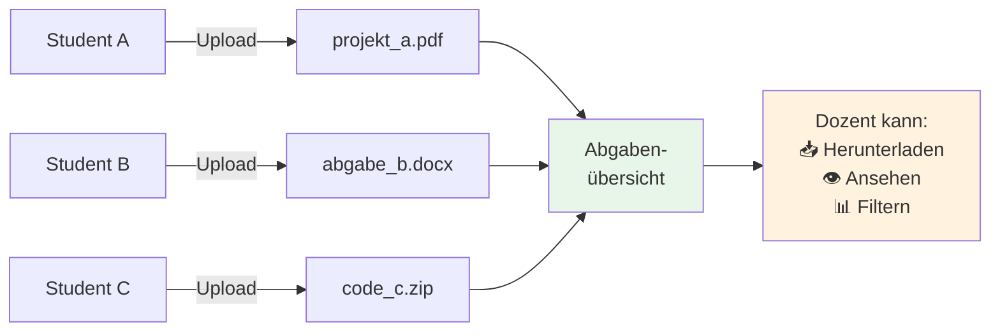
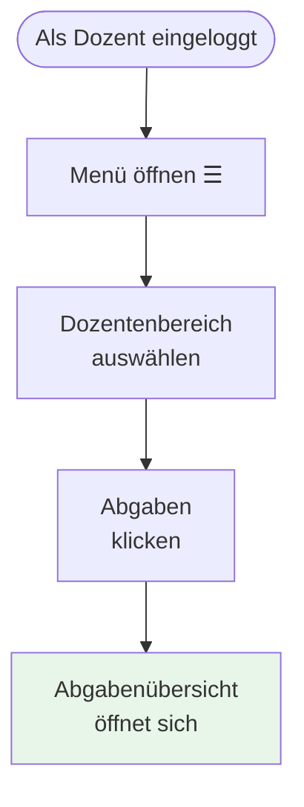
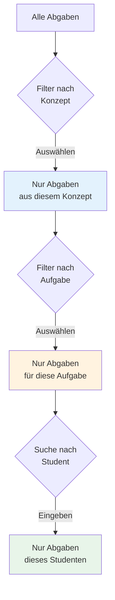
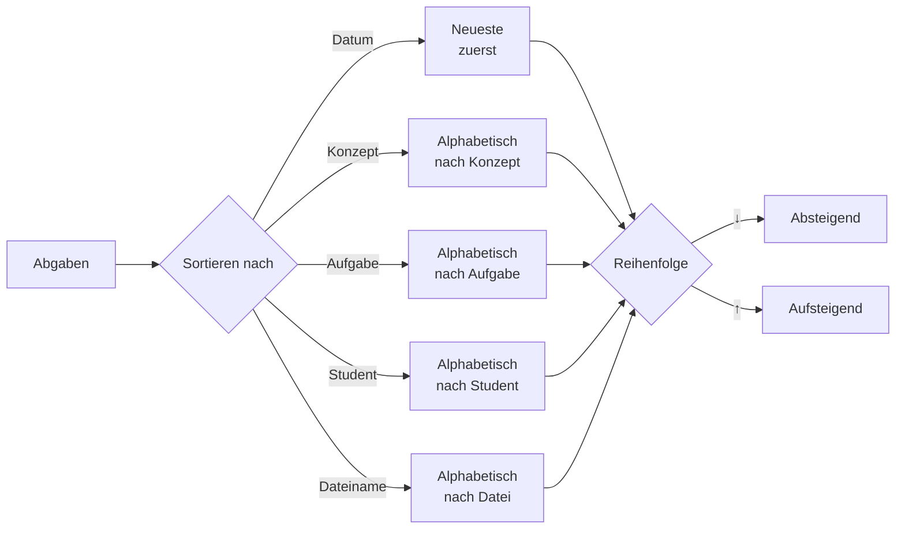
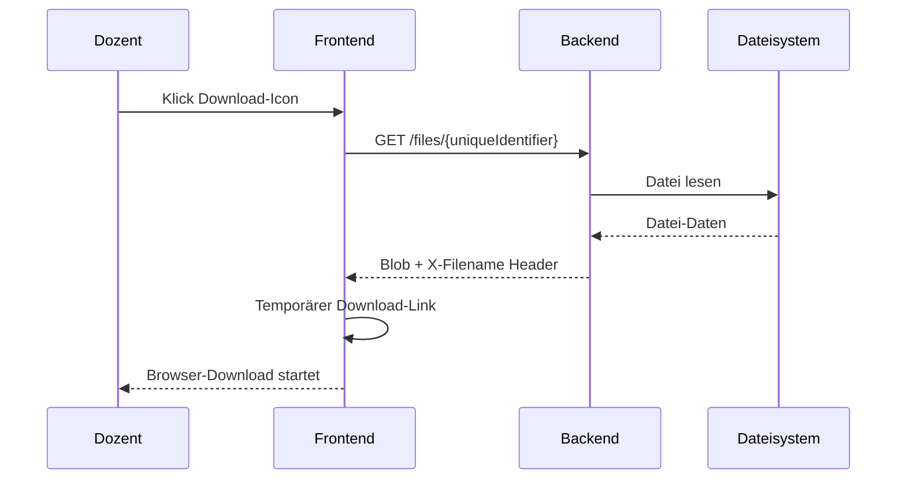
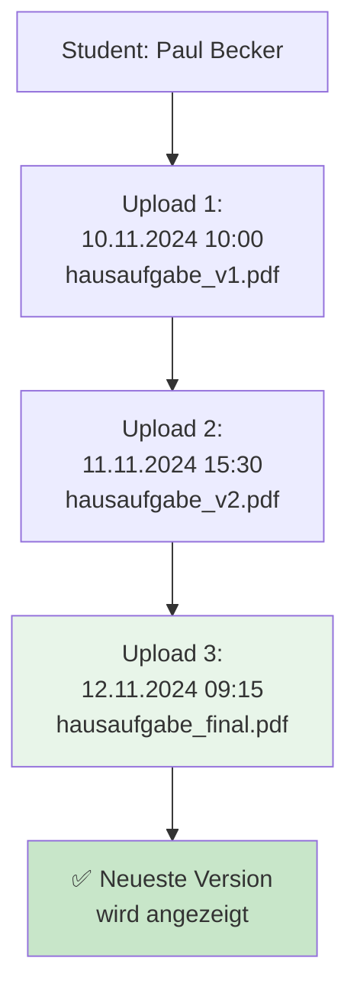
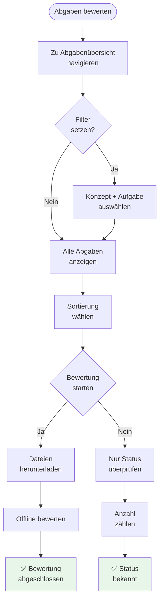

# Abgaben einsehen

**Hochgeladene Dateien von Studenten ansehen und verwalten**

---

## Inhaltsverzeichnis

1. [Übersicht](#übersicht)
2. [Zur Abgabenübersicht navigieren](#zur-abgabenübersicht-navigieren)
3. [Abgaben filtern und sortieren](#abgaben-filtern-und-sortieren)
4. [Datei herunterladen](#datei-herunterladen)
5. [Versionsverlauf ansehen](#versionsverlauf-ansehen)
6. [Abgabestatus überprüfen](#abgabestatus-überprüfen)
7. [Tipps für große Kurse](#tipps-für-große-kurse)

---

## Übersicht

### Was ist die Abgabenübersicht?

Die **Abgabenübersicht** zeigt Ihnen alle **hochgeladenen Dateien** von Studenten für Upload-Aufgaben.



### Wofür brauche ich das?

**Anwendungsfälle:**
- ✅ Überprüfen, **wer bereits abgegeben** hat
- ✅ Dateien **herunterladen** für Bewertung
- ✅ **Mehrfach-Uploads** eines Studenten ansehen (Versionsverlauf)
- ✅ Nach **Konzept, Aufgabe oder Student** filtern
- ✅ **Abgabestatus** für Reports exportieren

---

## Zur Abgabenübersicht navigieren

### Schritt-für-Schritt



**1. Menü öffnen**
   - Klicken Sie auf **☰** (Hamburger-Menü) oben links

**2. Dozentenbereich**
   - Wählen Sie **"Dozentenbereich"**

**3. Abgaben**
   - Unter "Meine Aufgaben" → **"Abgaben"**

**Alternative:**
- Direkt zur Route: `/lecturer/grading/uploads`

### UI-Übersicht

```
┌─────────────────────────────────────────────────────────────┐
│ Abgaben                                                     │
├─────────────────────────────────────────────────────────────┤
│ Filter:                                                     │
│ [Alle Konzepte ▼]  [Alle Aufgaben ▼]  [Suche Student___]   │
│                                                             │
│ Sortierung: [Nach Datum ▼] [↓ Absteigend]                  │
├───┬────────────────┬────────────────┬──────────┬───────────┤
│ ▼ │ Konzept        │ Aufgabe        │ Student  │ Datei     │
├───┼────────────────┼────────────────┼──────────┼───────────┤
│ ▶ │ OOP Grundlagen │ Projekt-Abgabe │ Lisa K.  │ 15.11.24  │
├───┼────────────────┼────────────────┼──────────┼───────────┤
│ ▶ │ OOP Grundlagen │ Projekt-Abgabe │ Jan G.   │ 14.11.24  │
├───┼────────────────┼────────────────┼──────────┼───────────┤
│ ▼ │ Datenstrukturen│ Hausaufgabe 3  │ Paul B.  │ 10.11.24  │
│   │                │                │          │ ┌───────┐ │
│   │                │                │          │ │ v3    │ │
│   │                │                │          │ │ v2    │ │
│   │                │                │          │ │ v1 ✓  │ │
│   │                │                │          │ └───────┘ │
└───┴────────────────┴────────────────┴──────────┴───────────┘
```

---

## Abgaben filtern und sortieren

### Filter-Optionen

Die Abgabenübersicht bietet **drei Filter**:



#### Filter 1: Nach Konzept

**Dropdown:** "Alle Konzepte"

**Zweck:**
- Zeigt nur Abgaben aus einem spezifischen Lernkonzept
- Beispiel: "Objektorientierte Programmierung"

**Wann nutzen:**
- Sie betreuen mehrere Kurse
- Sie wollen sich auf ein Thema fokussieren

**Beispiel:**
```
Vorher: 150 Abgaben (alle Konzepte)
Filter "OOP Grundlagen": 45 Abgaben
```

#### Filter 2: Nach Aufgabe

**Dropdown:** "Alle Aufgaben"

**Zweck:**
- Zeigt nur Abgaben für eine spezifische Upload-Aufgabe
- Beispiel: "Projekt-Abgabe"

**Wann nutzen:**
- Sie wollen nur eine bestimmte Aufgabe bewerten
- Sie prüfen Abgabestatus einer Aufgabe

**Tipp:** Kombinierbar mit Konzept-Filter!

**Beispiel:**
```
Konzept: OOP Grundlagen (45 Abgaben)
+ Aufgabe: Projekt-Abgabe
= 20 Abgaben
```

#### Filter 3: Nach Student

**Textfeld:** "Suche Student"

**Zweck:**
- Findet alle Abgaben eines bestimmten Studenten
- Sucht nach E-Mail oder Name

**Wann nutzen:**
- Student fragt: "Haben Sie meine Abgabe?"
- Sie wollen Abgaben eines Studenten überprüfen
- Sie suchen nach einem bestimmten Upload

**Beispiel:**
```
Eingabe: "lisa.klein@"
Ergebnis: Alle Abgaben von Lisa Klein (aus allen Konzepten/Aufgaben)
```

### Sortier-Optionen

**Dropdown:** "Sortierung"



**Optionen:**
- **Nach Datum:** Neueste/Älteste zuerst
- **Nach Konzept:** Alphabetisch A-Z oder Z-A
- **Nach Aufgabe:** Alphabetisch
- **Nach Student:** Alphabetisch nach E-Mail
- **Nach Dateiname:** Alphabetisch

**Reihenfolge umkehren:**
- Klick auf **↓/↑** Button neben Dropdown

---

## Datei herunterladen

### Einzelne Datei herunterladen

**Schritt-für-Schritt:**

1. **Abgabe finden**
   - Nutzen Sie Filter/Sortierung
   - Identifizieren Sie die gewünschte Zeile

2. **Download-Icon klicken**
   - Jede Zeile hat ein **📥 Download-Icon**

3. **Browser lädt Datei herunter**
   - Datei wird mit **Original-Namen** gespeichert
   - Beispiel: `projekt_gruppe1.pdf`

**Was passiert im Hintergrund:**



**Technische Details:**
- Backend sendet **X-Filename** Header mit Original-Namen
- Frontend erstellt temporären Blob-URL
- Browser downloaded mit korrektem Dateinamen
- Blob-URL wird nach Download aufgeräumt

### Mehrere Dateien herunterladen

**Aktuell:** Einzeln herunterladen, kein Batch-Download

**Workaround für viele Dateien:**

1. **Filter nutzen:**
   - Konzept + Aufgabe auswählen
   - Reduziert Liste auf relevante Abgaben

2. **Einzeln durchklicken:**
   - Download 1, Download 2, ...
   - Browser öffnet Downloads nacheinander

3. **Dateimanager organisieren:**
   - Alle Downloads landen im Download-Ordner
   - Sortieren Sie dort nach Name/Datum

**🚧 Geplant:**
- Batch-Download (ZIP-Archiv)
- Export als CSV (Metadaten)

---

## Versionsverlauf ansehen

### Was ist der Versionsverlauf?

Wenn ein Student **mehrmals hochlädt**, werden alle Versionen gespeichert:



### Gruppierung

Die Abgabenübersicht **gruppiert** Uploads automatisch:

**Gruppierungs-Kriterien:**
```
Konzept + Aufgabe + Student-E-Mail
```

**Beispiel:**
```
Gruppe 1:
├─ Konzept: "OOP Grundlagen"
├─ Aufgabe: "Hausaufgabe 3"
├─ Student: "paul.becker@uni.de"
└─ Uploads:
   ├─ v3 (12.11.2024 09:15) ← NEUESTE
   ├─ v2 (11.11.2024 15:30)
   └─ v1 (10.11.2024 10:00) ← ÄLTESTE
```

### Versionen anzeigen

**Schritt-für-Schritt:**

1. **Gruppierte Zeile finden**
   - Zeilen mit **▶** (Dreieck) haben mehrere Versionen

2. **Gruppe aufklappen**
   - Klick auf **▶** → wird zu **▼**

3. **Alle Versionen erscheinen:**

```
┌───┬────────────────┬────────────────┬──────────┬──────────────┐
│ ▼ │ OOP Grundlagen │ Hausaufgabe 3  │ Paul B.  │ 12.11.24     │
│   │                │                │          │ ┌──────────┐ │
│   │                │                │          │ │ 📥 v3 ✓  │ │
│   │                │                │          │ │ 12.11.24 │ │
│   │                │                │          │ │ 09:15    │ │
│   │                │                │          │ ├──────────┤ │
│   │                │                │          │ │ 📥 v2    │ │
│   │                │                │          │ │ 11.11.24 │ │
│   │                │                │          │ │ 15:30    │ │
│   │                │                │          │ ├──────────┤ │
│   │                │                │          │ │ 📥 v1    │ │
│   │                │                │          │ │ 10.11.24 │ │
│   │                │                │          │ │ 10:00    │ │
│   │                │                │          │ └──────────┘ │
└───┴────────────────┴────────────────┴──────────┴──────────────┘
```

**Legende:**
- **✓** = Neueste Version (hervorgehoben)
- **v3, v2, v1** = Versions-Nummern (absteigend)
- **Datum + Zeit** = Upload-Zeitstempel
- **📥** = Download-Icon (jede Version einzeln downloadbar)

### Welche Version bewerten?

**Empfehlung:** Immer die **neueste Version** (mit ✓)

**Warum?**
- Student hat möglicherweise Fehler korrigiert
- Neueste = Student's finale Abgabe
- Ältere Versionen = Entwürfe/Zwischenstände

**Ausnahme:**
- Sie wollen Versionsverlauf nachvollziehen
- Verdacht auf Plagiat (Vergleich mit älteren Versionen)

---

## Abgabestatus überprüfen

### Wer hat abgegeben?

**Frage:** "Haben alle Studenten abgegeben?"

**Antwort finden:**

1. **Filter nach Aufgabe** setzen
   - Beispiel: "Projekt-Abgabe"

2. **Anzahl zählen:**
   - Wie viele Zeilen werden angezeigt?
   - Beispiel: 18 Abgaben

3. **Mit Teilnehmerzahl vergleichen:**
   - Kurs hat 20 Studenten
   - 18 haben abgegeben
   - **2 fehlen noch**

### Wer fehlt?

**Aktuell:** Manueller Abgleich nötig

**Vorgehensweise:**

1. **Exportieren Sie Studentenliste**
   - Aus Benutzerverwaltung oder LMS

2. **Exportieren Sie Abgabenliste**
   - Screenshot oder manuelle Notiz

3. **Vergleichen:**
   - Wer ist in Studentenliste, aber nicht in Abgabenliste?

**Beispiel-Abgleich:**
```
Studentenliste:              Abgabenliste:
├─ Lisa Klein                ├─ Lisa Klein ✅
├─ Jan Groß                  ├─ Jan Groß ✅
├─ Sara Braun                ├─ Paul Becker ✅
├─ Tim Neu                   └─ Eva Lang ✅
├─ Paul Becker
├─ Eva Lang
├─ Finn Kurz                 ← FEHLT
└─ Nina Alt                  ← FEHLT
```

**🚧 Geplant:**
- Automatische Abgabestatus-Übersicht
- Export als CSV mit allen Studenten + Status
- Filter: "Nur fehlende Abgaben"

### Abgabezeitpunkt überprüfen

**Frage:** "Wer hat nach Deadline abgegeben?"

**Vorgehensweise:**

1. **Sortieren nach Datum** (neueste zuerst)

2. **Deadline merken**
   - Beispiel: 15.11.2024 23:59

3. **Liste durchgehen:**
   - Abgaben **nach** 15.11.2024 → Verspätung

**Beispiel:**
```
Sorted by Date (neueste zuerst):
├─ 16.11.2024 10:30 - Lisa Klein   ← VERSPÄTET
├─ 15.11.2024 23:45 - Jan Groß     ← PÜNKTLICH
├─ 15.11.2024 18:00 - Sara Braun   ← PÜNKTLICH
└─ 14.11.2024 09:15 - Tim Neu      ← PÜNKTLICH
```

**Tipp:** Kommunizieren Sie Konsequenzen für Verspätung vorab!

---

## Tipps für große Kurse

### 📊 Große Datenmengen verwalten

**Problem:** 100+ Studenten, 5 Aufgaben = 500+ Abgaben

**Lösung 1: Filter kombinieren**
```
Schritt 1: Konzept auswählen (z.B. "OOP Grundlagen")
  → 150 Abgaben

Schritt 2: Aufgabe auswählen (z.B. "Projekt-Abgabe")
  → 30 Abgaben

Schritt 3: Überschaubare Liste!
```

**Lösung 2: Aufgaben nacheinander bewerten**
- Nicht alle auf einmal
- Pro Woche: 1 Aufgabe komplett
- Vermeidet Überforderung

### 📁 Download-Organisation

**Problem:** 30 Dateien heruntergeladen, alle heißen "abgabe.pdf"

**Lösung 1: Browser-Downloads umbenennen**
- Nach Download: Rechtsklick → "Umbenennen"
- Schema: `[Student]_[Aufgabe].pdf`
- Beispiel: `Lisa_Klein_Projekt.pdf`

**Lösung 2: Ordnerstruktur**
```
Downloads/
├─ OOP_Grundlagen/
│  ├─ Projekt_Abgabe/
│  │  ├─ Lisa_Klein_Projekt.pdf
│  │  ├─ Jan_Gross_Projekt.pdf
│  │  └─ ...
│  └─ Hausaufgabe_3/
│     ├─ ...
└─ Datenstrukturen/
   └─ ...
```

**Lösung 3: Batch-Umbenennung**
- Tools: Bulk Rename Utility (Windows), Automator (Mac)
- Regex-Patterns für systematische Umbenennung

### ⏱️ Zeitmanagement

**Problem:** 100 Abgaben bewerten = viel Zeit

**Strategie 1: Bewertungsraster**
```
Schnelle Bewertung pro Abgabe:
├─ 2 Min: Datei öffnen + überfliegen
├─ 3 Min: Detailprüfung anhand Kriterien
├─ 2 Min: Note eintragen + Feedback
└─ = 7 Min pro Abgabe

100 Abgaben × 7 Min = 700 Min = ~12 Stunden
Verteilung: 3 Stunden pro Tag, 4 Tage = machbar
```

**Strategie 2: Peer-Review nutzen**
- Studenten bewerten gegenseitig (70%)
- Sie stichprobenartig (30%)
- **Siehe:** [Peer-Review einrichten](04-peer-review-einrichten.md)

**Strategie 3: Automatisierte Tests**
- Für Code-Aufgaben: Judge0
- Für Formatierung: Automatische Checks
- Reduziert manuelle Arbeit

### 🔍 Verdacht auf Plagiat

**Workflow:**

1. **Versionsverlauf prüfen**
   - Gab es Zwischen-Uploads?
   - Plötzlicher Qualitätssprung verdächtig

2. **Vergleich mit anderen Abgaben**
   - Download beide Dateien
   - Manueller Vergleich oder Tools (z.B. Diff-Tool)

3. **Externe Quellen prüfen**
   - Google-Suche nach spezifischen Textpassagen
   - Plagiat-Checker (falls verfügbar)

4. **Student kontaktieren**
   - Persönliches Gespräch
   - Nachfragen zu Konzepten

---

## Zusammenfassung: Workflow



---

## Häufige Fragen

### Kann ich Abgaben direkt im Browser ansehen?

**Aktuell:** Nein, nur Download möglich

**Workaround:**
- Datei herunterladen
- Mit lokalem PDF-Viewer öffnen

**🚧 Geplant:**
- Inline PDF-Viewer
- Direkte Annotation im Browser

### Werden gelöschte Uploads behalten?

**Ja!** Wenn ein Student eine Datei **ersetzt**, bleibt die alte Version erhalten.

**Aber:** Wenn Sie als Dozent eine Aufgabe **löschen**, gehen alle Uploads verloren.

### Kann ich Abgaben kommentieren/annotieren?

**Aktuell:** Nein, keine integrierte Funktion

**Workaround:**
- PDF lokal mit Annotations-Software bearbeiten (z.B. Adobe Acrobat)
- Kommentierte Version per Mail zurücksenden oder in LMS hochladen

**🚧 Geplant:**
- Inline-Kommentare
- Rubric-basierte Bewertung

### Wie exportiere ich Abgabenliste?

**Aktuell:** Screenshot oder manuelle Übertragung

**🚧 Geplant:**
- CSV-Export
- Excel-Export mit Metadaten

---

## Weiterführende Themen

- **Upload-Aufgabe erstellen:** → [01-inhalte-verwalten.md](01-inhalte-verwalten.md#aufgabe-hinzufügen)
- **Peer-Review einrichten:** → [04-peer-review-einrichten.md](04-peer-review-einrichten.md)
- **Studentengruppen:** → [03-studentengruppen-verwalten.md](03-studentengruppen-verwalten.md)

---

*Zurück zur [Übersicht](00-uebersicht-dozentenbereich.md)*
