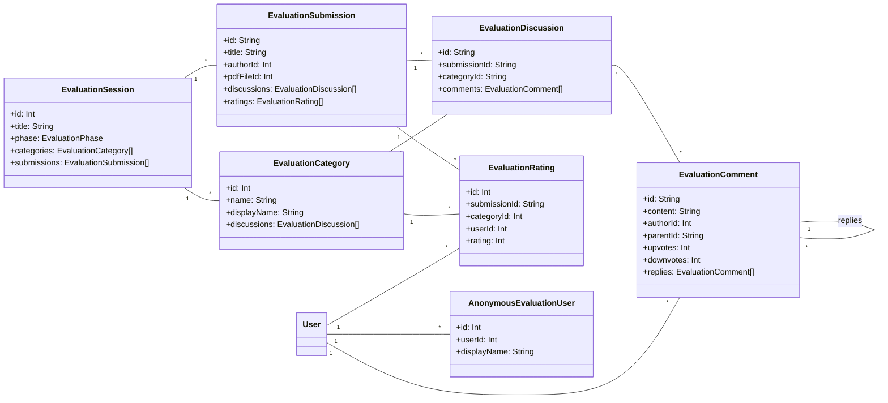
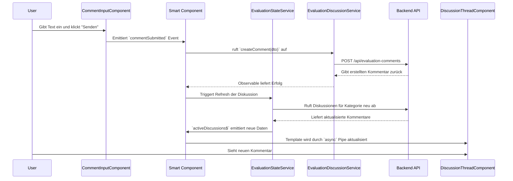

# Technisches Handbuch: Bewertungs- und Diskussionsforum

## 1. Einleitung

Dieses Dokument bietet eine technische Übersicht über das Feature "Bewertungs- und Diskussionsforum" innerhalb der HEFL-Plattform. Es richtet sich an Entwickler und Architekten und beschreibt die Systemarchitektur, die Datenmodelle, die API-Endpunkte und die Frontend-Komponenten.

Das Forum ermöglicht es Benutzern, PDF-basierte Einreichungen zu bewerten und in kategorisierten Threads zu diskutieren. Es unterstützt Phasen (Diskussion, Bewertung), anonyme Teilnahme und ein detailliertes Abstimmungssystem.

## 2. Architektur-Überblick

Die Architektur folgt modernen Best Practices mit einer klaren Trennung zwischen Frontend (Angular) und Backend (NestJS).

-   **Backend (NestJS)**: Stellt eine RESTful API bereit, die die gesamte Geschäftslogik kapselt. Es verwendet Prisma als ORM für die typsichere Datenbankkommunikation.
-   **Frontend (Angular)**: Baut auf einer reaktiven Architektur mit RxJS und einer klaren Trennung zwischen "smarten" Container-Komponenten und "dummen" Präsentations-Komponenten auf.
-   **Shared DTOs**: Ein gemeinsamer `shared/dtos`-Ordner definiert den typsicheren Datenvertrag zwischen Client und Server und ist die "Single Source of Truth" für die API-Kommunikation.

## 3. Datenmodell (Prisma Schema)

Das Herzstück des Systems ist ein gut strukturiertes Datenbankschema, das die Beziehungen zwischen Bewertungen, Diskussionen, Kommentaren und Benutzern abbildet.

## 4. Backend API Endpunkte

Das Backend stellt eine RESTful API zur Verfügung. Alle Endpunkte sind durch einen `JwtAuthGuard` geschützt.

| Methode | Endpunkt                                                              | Beschreibung                                                               |
| :------ | :-------------------------------------------------------------------- | :------------------------------------------------------------------------- |
| `GET`   | `/evaluation-sessions`                                                | Ruft alle Bewertungssitzungen ab.                                          |
| `POST`  | `/evaluation-sessions`                                                | Erstellt eine neue Bewertungssitzung. (Admin/Teacher)                      |
| `GET`   | `/evaluation-sessions/:id`                                            | Ruft eine spezifische Sitzung ab.                                          |
| `POST`  | `/evaluation-sessions/:id/switch-phase`                               | Wechselt die Phase einer Sitzung (z.B. von Diskussion zu Bewertung).       |
| `GET`   | `/evaluation-sessions/:id/categories`                                 | Ruft die Kategorien für eine Sitzung ab.                                   |
| `GET`   | `/evaluation-submissions/:id`                                         | Ruft eine spezifische Einreichung ab.                                      |
| `GET`   | `/evaluation-submissions/:id/pdf`                                     | Stellt die PDF-Datei einer Einreichung bereit.                             |
| `GET`   | `/evaluation-submissions/:id/comment-stats`                           | Ruft Kommentarstatistiken für einen Benutzer ab.                           |
| `GET`   | `/evaluation-comments`                                                | Ruft Kommentare für eine Einreichung/Kategorie ab.                         |
| `POST`  | `/evaluation-comments`                                                | Erstellt einen neuen Kommentar.                                            |
| `PUT`   | `/evaluation-comments/:id`                                            | Aktualisiert einen Kommentar.                                              |
| `DELETE`| `/evaluation-comments/:id`                                            | Löscht einen Kommentar.                                                    |
| `POST`  | `/evaluation-comments/:id/vote`                                       | Gibt eine Stimme für einen Kommentar ab oder zieht sie zurück.             |
| `GET`   | `/evaluation-comments/:id/user-vote`                                  | Ruft die Stimme des aktuellen Benutzers für einen Kommentar ab.            |
| `POST`  | `/evaluation-ratings`                                                 | Erstellt oder aktualisiert eine Bewertung für eine Kategorie.              |
| `GET`   | `/evaluation-ratings/submission/:submissionId/user/status`            | Ruft den Bewertungsstatus des Benutzers für alle Kategorien ab.            |

## 5. Frontend-Architektur

Das Frontend ist als eigenständiges Modul implementiert und folgt dem **Smart/Dumb Component Pattern**.

### 5.1 Hauptkomponente (Smart Component)

-   **`EvaluationDiscussionForumComponent`**:
    -   Orchestriert den gesamten Zustand der Ansicht.
    -   Kommuniziert über Services mit dem Backend.
    -   Verwendet einen reaktiven `viewModel$` (basierend auf `combineLatest`), um den Zustand an die Dumb Components weiterzugeben.
    -   Verwaltet den Phasenwechsel und zeigt je nach Phase (Diskussion/Bewertung) unterschiedliche UI-Elemente an.

### 5.2 Präsentationskomponenten (Dumb Components)

-   **`CategoryTabsComponent`**: Zeigt die Bewertungskategorien als Tabs an und emittiert die Auswahl des Benutzers.
-   **`PdfViewerPanelComponent`**: Stellt die PDF-Datei mit Navigations- und Zoom-Steuerelementen dar.
-   **`DiscussionThreadComponent`**: Zeigt die Kommentarliste für die aktive Kategorie an. Nutzt `cdk-virtual-scroll-viewport` für die Performance bei langen Diskussionen.
-   **`CommentItemComponent`**: Stellt einen einzelnen Kommentar dar, inklusive Autor, Inhalt, Zeitstempel und Voting-Box. Kann rekursiv für Antworten verwendet werden.
-   **`VoteBoxComponent`**: UI für das Up- und Downvoting von Kommentaren.
-   **`CommentInputComponent`**: Formular zur Eingabe neuer Kommentare.
-   **`RatingGateComponent`**: Eine entscheidende Komponente, die den Zugang zur Diskussion steuert. Sie zeigt entweder den `RatingSliderComponent` (wenn der Benutzer noch nicht bewertet hat) oder den `DiscussionThreadComponent` (nach erfolgter Bewertung) an.
-   **`RatingSliderComponent`**: Ermöglicht dem Benutzer die Abgabe einer numerischen Bewertung (0-10) für eine Kategorie.

### 5.3 Services

-   **`EvaluationDiscussionService`**: Kapselt alle HTTP-Aufrufe an das Backend.
-   **`EvaluationStateService`**: Verwaltet den Client-seitigen Zustand mit RxJS `BehaviorSubject`s. Er dient als lokaler Store für den aktuellen Zustand des Forums (aktive Kategorie, geladene Diskussionen, Benutzerinformationen etc.) und reduziert so redundante API-Aufrufe.
-   **Performance & Globale Services**: Zusätzliche Services wie `EvaluationPerformanceService` und `EvaluationGlobalStateService` zeigen eine sehr ausgereifte Architektur zur Überwachung und Steuerung der Anwendung.

## 6. Typischer Datenfluss (Kommentar erstellen)

## 7. Fazit

Das Bewertungs- und Diskussionsforum ist eine technisch ausgereifte und gut strukturierte Full-Stack-Anwendung. Die klare Trennung von Verantwortlichkeiten, die durchgängige Typsicherheit und die reaktive Architektur machen das System robust, wartbar und erweiterbar.
