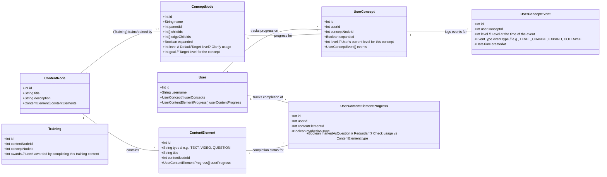
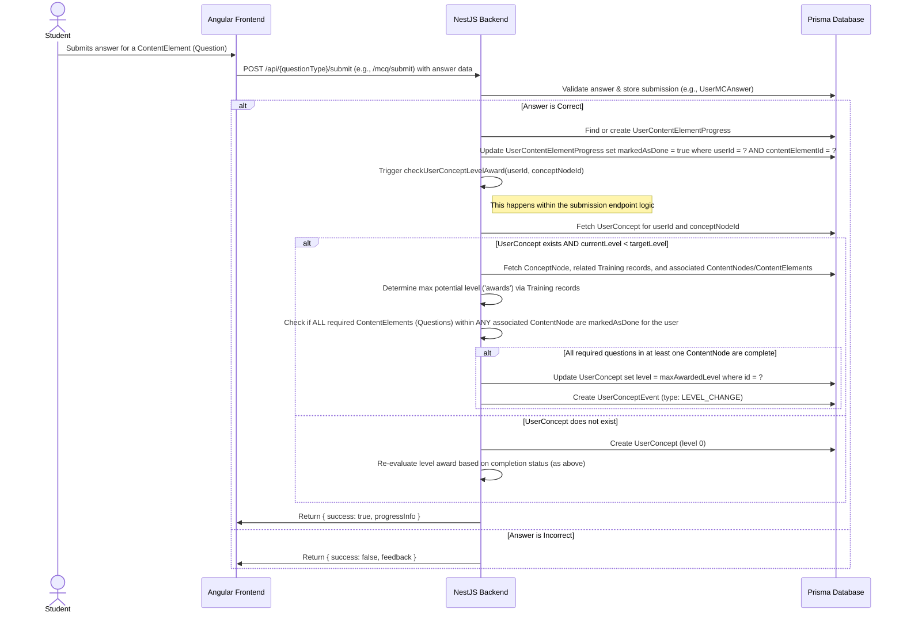
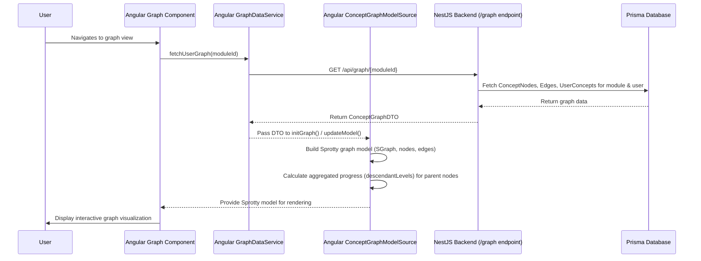
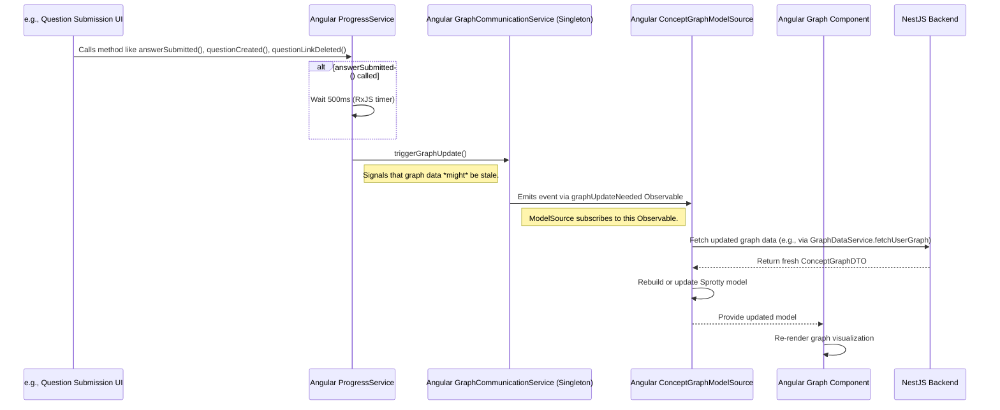

# Analysis of Progress Calculation and Graph Logic in HEFL

**Version:** 1.1
**Date:** 2025-04-01
**Audience:** Developers working on the HEFL application

## 1. Introduction

This document provides a technical analysis of the mechanisms governing task submission, student progress calculation, and knowledge graph visualization within the HEFL application. It is based on an examination of the Angular frontend (`client_angular`), Nest.js backend (`server_nestjs`), and the Prisma schema definition.

The core functionality allows students to interact with learning content, complete tasks (primarily questions), and visualize their progress on a directed acyclic graph (DAG) representing concept dependencies.

## 2. System Overview

The learning progress system revolves around these key concepts:

*   **Knowledge Graph:** A visual representation where concepts are nodes and dependencies are edges.
*   **Concept Nodes (`ConceptNode`):** Represent individual topics or skills within the knowledge graph.
*   **Content Nodes (`ContentNode`):** Contain learning materials (text, video, questions) associated with one or more Concept Nodes.
*   **Content Elements (`ContentElement`):** Individual pieces of content within a Content Node (e.g., a paragraph, an MCQ).
*   **Tasks/Questions:** Specific `ContentElement` items (e.g., type `QUESTION`) that students complete to demonstrate understanding.
*   **Levels:** A numerical representation (typically 0-6) of a student's proficiency in a `ConceptNode`.
*   **Progress Tracking:** The system tracks which `ContentElement` items are completed (`markedAsDone`) and updates the `UserConcept` level accordingly.
*   **Graph Visualization:** The Angular frontend displays the knowledge graph, visually indicating progress (e.g., node color, completion indicators) based on `UserConcept` data. Parent nodes aggregate the progress visualization of their descendants.

## 3. Data Model (Prisma Schema)

The following diagram illustrates the key Prisma models involved in progress tracking and their relationships.



**Key Entities & Relationships:**

*   **`ConceptNode`**: Represents a learnable concept in the graph.
*   **`ContentNode`**: A container for learning materials (`ContentElement`s).
*   **`ContentElement`**: An individual piece of learning material (text, video, question).
*   **`Training`**: Links `ContentNode`s to `ConceptNode`s, specifying the proficiency level (`awards`) granted upon completion.
*   **`UserConcept`**: Tracks a specific `User`'s progress (`level`) and interaction state (`expanded`) for a `ConceptNode`.
*   **`UserContentElementProgress`**: Tracks a `User`'s completion status (`markedAsDone`) for a specific `ContentElement`. This is the primary trigger for progress updates.
*   **`UserConceptEvent`**: Logs significant events related to a `UserConcept`, such as level changes.

## 4. Task Submission and Progress Update Flow

This sequence diagram details the process from a student submitting an answer to the potential update of their concept level.



**Flow Breakdown:**

1.  **Submission:** The student submits an answer via the Angular frontend.
2.  **Backend Validation:** The NestJS backend receives the submission, validates the answer against the correct solution, and stores the submission record.
3.  **Mark as Done:** If the answer is correct, the crucial step is updating the corresponding `UserContentElementProgress` record, setting `markedAsDone = true`.
4.  **Trigger Level Check:** This update triggers the `checkUserConceptLevelAward` function within the backend's `UserConceptService`.
5.  **Level Award Logic (`checkUserConceptLevelAward`):**
    *   Retrieves the relevant `UserConcept`.
    *   Checks if the user's current level is already at or above the maximum level awarded by associated `Training` records.
    *   Iterates through `ContentNode`s linked via `Training` to the `ConceptNode`.
    *   For each `ContentNode`, it verifies if **all** `ContentElement`s of type `QUESTION` are marked as done for the user.
    *   If all questions in *any single* linked `ContentNode` are complete, the user's `UserConcept.level` is updated to the maximum `awards` value from the relevant `Training` records (only if the new level is higher).
    *   A `UserConceptEvent` of type `LEVEL_CHANGE` is created to log the update.
6.  **Response:** The backend returns a success or failure response to the frontend.

## 5. Graph Visualization and Automatic Refresh

The knowledge graph is rendered by the Angular frontend, primarily using components in `client_angular/src/app/Pages/graph` and leveraging the Sprotty library via `client_angular/src/app/Pages/graph/sprotty/model-source.ts`.

### 5.1. Initial Graph Load



### 5.2. Automatic Graph Refresh Mechanism

The graph visualization updates automatically *without* requiring manual page reloads when progress-altering actions occur. This is orchestrated by `GraphCommunicationService` and `ProgressService` in the Angular frontend.



**Key Components:**

*   **`GraphCommunicationService` (`client_angular/src/app/Services/graph/graphCommunication.service.ts`):**
    *   Implemented as a **Singleton** to provide a single, shared communication channel.
    *   Uses an RxJS `Subject` (`graphUpdateTrigger`) to broadcast update notifications.
    *   Exposes an `Observable` (`graphUpdateNeeded`) for other services/components to subscribe to.
    *   The `triggerGraphUpdate()` method is called to initiate the notification.
*   **`ProgressService` (`client_angular/src/app/Services/progress/progress.service.ts`):**
    *   Injects or obtains the singleton instance of `GraphCommunicationService`.
    *   Calls `graphCommunicationService.triggerGraphUpdate()` in response to:
        *   `answerSubmitted()`: After a 500ms delay (using RxJS `timer` and `concatMap`) to allow backend processing.
        *   `questionCreated()`: Immediately.
        *   `questionLinkDeleted()`: Immediately.
*   **`ConceptGraphModelSource` (`client_angular/src/app/Pages/graph/sprotty/model-source.ts`):**
    *   Subscribes to `graphCommunicationService.graphUpdateNeeded` in its constructor.
    *   When an update event is received, it triggers a refetch of the graph data from the backend (likely via `GraphDataService`).
    *   Updates the internal Sprotty model, causing the `GraphComponent` to re-render.

**Conclusion:** The graph *is* designed to update automatically upon task completion or relevant changes, driven by the frontend's `ProgressService` and `GraphCommunicationService`.

## 6. Analysis: Potential Issues and Optimizations

### 6.1. Identified Issues & Limitations

1.  **Progress Calculation Trigger Reliability:** The entire progress update hinges on `markedAsDone = true` being set correctly in `UserContentElementProgress` by *every* relevant submission endpoint in the backend. Any omission breaks the chain.
2.  **"All Questions" Logic:** Requiring *all* questions within a `ContentNode` to be completed before awarding *any* level might be too strict and demotivating. There's no concept of partial completion contributing to the level.
3.  **Max Level Award:** Awarding the maximum level associated via `Training` means completing lower-level `ContentNode`s might grant no visible progress if a higher-level `Training` link exists for the same `ConceptNode`. This could confuse users.
4.  **Graph Re-render Inefficiency:** Fetching and re-rendering the entire graph upon every `triggerGraphUpdate()` event can be inefficient for large graphs, even if only a small part changed.
5.  **Fixed Delay:** The 500ms delay in `answerSubmitted()` is arbitrary. It might be too short for slow backend operations or unnecessarily long for fast ones.
6.  **Lack of Granular Feedback:** While the graph updates, there appear to be no immediate, specific user notifications (e.g., "Level Up!") upon achieving a new concept level.

### 6.2. Potential Optimizations & Enhancements

1.  **Real-time Backend Push:** Replace the frontend polling/trigger mechanism with WebSockets or Server-Sent Events (SSE) initiated by the backend upon successful level updates. This provides true real-time updates.
2.  **Incremental Graph Updates:** Modify the frontend (`ConceptGraphModelSource`) and potentially the backend API to support partial graph updates, only transmitting and re-rendering changed nodes/edges.
3.  **Flexible Progress Rules:** Introduce configurable rules for level awards (e.g., percentage of questions completed, weighted questions).
4.  **Improved User Feedback:** Implement toast notifications or animations triggered by `LEVEL_CHANGE` events (potentially pushed via WebSockets/SSE).
5.  **Refined Delay/Trigger:** Replace the fixed 500ms delay with a more robust mechanism, perhaps confirming backend completion before triggering the frontend update, or using debouncing if rapid updates are possible.
6.  **Code Structure:**
    *   Refactor `GraphCommunicationService` to use Angular's standard `providedIn: 'root'` for singleton behavior instead of the manual static `getInstance()` pattern.
    *   Enhance error handling within the RxJS pipes in `ProgressService`.
    *   Add comprehensive JSDoc/TSDoc comments to clarify complex logic, especially in `UserConceptService` and `ConceptGraphModelSource`.

## 7. Appendix: Consolidated Flow Diagram

This diagram combines the submission, level check, and graph update flows.

```mermaid
sequenceDiagram
    actor Student
    participant QuestionUI as Angular Question UI
    participant BackendAPI as NestJS Backend API
    participant UserConceptService as Backend UserConceptService
    participant DB as Prisma Database
    participant ProgressService as Angular ProgressService
    participant GraphCommService as Angular GraphCommunicationService
    participant ModelSource as Angular ConceptGraphModelSource
    participant GraphComponent as Angular Graph Component

    Student->>QuestionUI: Solve question & Submit
    QuestionUI->>BackendAPI: POST /api/.../submit
    BackendAPI->>UserConceptService: Validate & store answer
    UserConceptService->>DB: Store submission, Set markedAsDone=true

    alt Answer Correct & Level Check Triggered
        UserConceptService->>UserConceptService: checkUserConceptLevelAward()
        UserConceptService->>DB: Fetch related data (UserConcept, Training, ContentNodes...)
        alt Level Awarded
            UserConceptService->>DB: Update UserConcept.level
            UserConceptService->>DB: Create UserConceptEvent (LEVEL_CHANGE)
        end
        BackendAPI-->>ProgressService: Return { success: true }
        Note over ProgressService, GraphCommService: answerSubmitted() called

        ProgressService->>ProgressService: Wait 500ms
        ProgressService->>GraphCommService: triggerGraphUpdate()
        GraphCommService->>ModelSource: Emit graphUpdateNeeded event
        ModelSource->>BackendAPI: GET /api/graph/{moduleId} (fetch updated data)
        BackendAPI-->>ModelSource: Return ConceptGraphDTO
        ModelSource->>GraphComponent: Update Sprotty model
        GraphComponent->>GraphComponent: Re-render graph
    else Answer Incorrect
        BackendAPI-->>QuestionUI: Return { success: false }
    end

    QuestionUI->>Student: Show completion feedback

    %% Separate action: User navigates to graph %%
    Student->>GraphComponent: Navigate to graph view
    GraphComponent->>ModelSource: Request model (potentially triggers fetch if not already updated)
    ModelSource-->>GraphComponent: Provide current model
    GraphComponent->>Student: Display graph
    Note over GraphComponent, Student: Graph shown reflects latest state due to automatic updates.