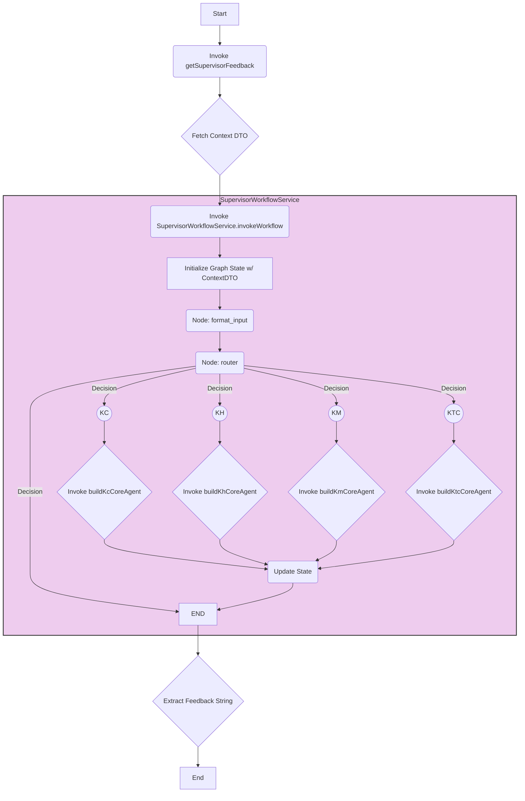

# LangGraph Feedback System Documentation

## 1. Overview

This module implements a feedback system for student programming submissions using LangChain's LangGraph library. It provides targeted feedback by routing requests to specialized AI agents (KC, KH, KM, KTC) based on the context of the submission (code, task description, compiler output, test results). The system can operate in two modes:

1.  **Supervisor Workflow:** A supervisor agent analyzes the context and routes the request to the most appropriate specialist agent.
2.  **Direct Agent Call:** Allows invoking a specific specialist agent directly via dedicated API endpoints.

## 2. Architecture

The system is designed with modularity and separation of concerns in mind, following NestJS best practices:

*   **Isolated Agents:** Each agent (KC, KH, KM, KTC) and the Supervisor workflow are encapsulated within their own directories (`agents/[agent-name]/`).
*   **Providers:** Dedicated NestJS providers (`[AgentName]AgentProvider`) are responsible for instantiating agent chains, managing their specific dependencies (like tools).
*   **Facade Service:** `LanggraphFeedbackService` acts as a central facade, simplifying interaction with the system by providing methods to invoke either the supervisor workflow or individual agents.
*   **Dependency Injection:** Shared resources like the `ChatOpenAI` model and tool services (`DomainKnowledgeService`) are managed by the `LanggraphFeedbackModule` and injected where needed.
*   **Controller:** `LanggraphFeedbackController` exposes HTTP endpoints for interacting with the system.
*   **Helpers:** Services like `LanggraphDataFetcherService` handle auxiliary tasks like retrieving context data.

### Architecture Diagram (Mermaid)

```mermaid
graph TD
    subgraph Module: LanggraphFeedbackModule
        direction LR
        P_LLM[Provider: CHAT_OPENAI_MODEL]
        P_DKS[Provider: DomainKnowledgeService]
        P_Fetcher[Provider: LanggraphDataFetcherService]
        P_Crypto[Provider: CryptoService]
        P_Supervisor[Provider: SupervisorWorkflowService]
        P_KC[Provider: KcAgentProvider]
        P_KH[Provider: KhAgentProvider]
        P_KM[Provider: KmAgentProvider]
        P_KTC[Provider: KtcAgentProvider]
        P_Facade[Provider: LanggraphFeedbackService]

        P_LLM --> P_Supervisor
        P_LLM --> P_KC
        P_LLM --> P_KH
        P_LLM --> P_KM
        P_LLM --> P_KTC

        P_DKS --> P_KC  // Only KC needs DomainKnowledgeService

        P_Supervisor --> P_Facade
        P_KC --> P_Facade
        P_KH --> P_Facade
        P_KM --> P_Facade
        P_KTC --> P_Facade

        P_Fetcher --> Controller
        P_Facade --> Controller
    end

    Controller[LanggraphFeedbackController] -->|uses| P_Facade
    Controller -->|uses| P_Fetcher

    style Module fill:#f9f,stroke:#333,stroke-width:2px
```

## 3. Components

### 3.1. Controller (`langgraph-feedback.controller.ts`)

*   **Responsibility:** Handles incoming HTTP requests for feedback. Exposes endpoints for the supervisor workflow and direct agent calls.
*   **Dependencies:** `LanggraphFeedbackService`, `LanggraphDataFetcherService`.
*   **Endpoints:**
    *   `POST /supervisor`: Fetches context using `LanggraphDataFetcherService` and invokes the supervisor workflow via `LanggraphFeedbackService.getSupervisorFeedback`.
    *   `POST /kc`: Fetches context and invokes the KC agent directly via `LanggraphFeedbackService.getKcFeedback`.
    *   `POST /kh`: Fetches context and invokes the KH agent directly via `LanggraphFeedbackService.getKhFeedback`.
    *   `POST /km`: Fetches context and invokes the KM agent directly via `LanggraphFeedbackService.getKmFeedback`.
    *   `POST /ktc`: Fetches context and invokes the KTC agent directly via `LanggraphFeedbackService.getKtcFeedback`.
*   **Input:** Uses `EvaluateRequestDto` (containing `questionId` and `relatedCodeSubmissionResult`) for all endpoints. Uses `ValidationPipe` for input validation.
*   **Output:** Returns `{ feedback: string | null }`.

### 3.2. Facade Service (`langgraph-feedback.service.ts`)

*   **Responsibility:** Provides a simplified interface to the feedback system. Decouples the controller from the underlying agent providers and workflow service.
*   **Dependencies:** `SupervisorWorkflowService`, `KcAgentProvider`, `KhAgentProvider`, `KmAgentProvider`, `KtcAgentProvider`.
*   **Methods:**
    *   `getSupervisorFeedback()`: Delegates to `SupervisorWorkflowService.invokeWorkflow()`. Extracts the final feedback string.
    *   `getKcFeedback()`: Gets the KC agent chain from `KcAgentProvider` and invokes it. Extracts relevant messages.
    *   `getKhFeedback()`, `getKmFeedback()`, `getKtcFeedback()`: Similar delegation for other agents.

### 3.3. Supervisor Workflow (`agents/supervisor/supervisor.workflow.ts`)

*   **Responsibility:** Manages and executes the LangGraph state machine for supervised feedback generation.
*   **Dependencies:** `ChatOpenAI` model, `DomainKnowledgeService` (for tool creation if core agents need it), `ConfigService`.
*   **Key Logic:**
    *   Defines the `GraphState` using `Annotation.Root`.
    *   Initializes the `StateGraph`.
    *   Defines nodes:
        *   `format_input`: Takes `FeedbackContextDto` from the initial state and creates the first `HumanMessage`.
        *   Agent Nodes (KC, KH, KM, KTC): Uses `wrapAgentNode` which invokes the *core* agent logic (`build[AgentName]CoreAgent`) with the current `state.messages`.
        *   `router`: Uses the `ChatOpenAI` model and `supervisor.prompt.ts` to decide the next agent or `END`.
    *   Defines edges connecting `__start__` -> `format_input` -> `router` -> Agent Nodes -> `__end__`.
    *   Compiles the graph (`this.supervisorGraph`).
    *   Provides `invokeWorkflow(contextInput)` method to run the graph.

### 3.4. Agent Providers (`agents/[agent-name]/[agent-name].provider.ts`)

*   **Responsibility:** Instantiates and provides ready-to-use agent chains for direct invocation. Handles dependency injection for agents.
*   **Dependencies:** `ChatOpenAI` model, relevant tool services (e.g., `DomainKnowledgeService` for `KcAgentProvider`).
*   **Key Logic:**
    *   Injects shared dependencies (LLM, tool services).
    *   Instantiates necessary tools (e.g., `domainKnowledgeTool` in `KcAgentProvider`).
    *   Provides a `getAgentChain()` method that calls the corresponding `build[AgentName]AgentChain` function from `[agent-name].agent.ts`, passing the injected dependencies.

### 3.5. Agent Logic (`agents/[agent-name]/[agent-name].agent.ts`)

*   **Responsibility:** Defines the structure and logic of an individual agent.
*   **Exports:**
    *   `build[AgentName]CoreAgent(llm, tools)`: Creates the core agent runnable (using `createReactAgent`) without input formatting. Used by the `SupervisorWorkflowService`.
    *   `build[AgentName]AgentChain(llm, tools)`: Creates the complete agent chain, including an initial `RunnableLambda` for input formatting (from `FeedbackContextDto` to `{ messages: [...] }`) piped into the core agent. Used by the `[AgentName]AgentProvider` for direct calls.

### 3.6. Agent Prompts (`agents/[agent-name]/[agent-name].prompts.ts`)

*   **Responsibility:** Stores and exports the system prompt string for a specific agent.

### 3.7. Tools (`tools/`)

*   **Responsibility:** Encapsulates specific functionalities agents can use (e.g., `DomainKnowledgeService` for searching lecture materials).
*   Contains the tool's service logic and a function to create the LangChain tool instance (e.g., `createDomainKnowledgeTool`).

### 3.8. Helpers (`helper/`)

*   **Responsibility:** Contains utility services like `LanggraphDataFetcherService` for retrieving data needed to populate the `FeedbackContextDto`.

### 3.9. Module (`langgraph-feedback.module.ts`)

*   **Responsibility:** Declares all components (controllers, services, providers) belonging to this feature and manages their dependencies and visibility.
*   **Key Providers:**
    *   `LanggraphFeedbackService` (Facade)
    *   `SupervisorWorkflowService`
    *   `KcAgentProvider`, `KhAgentProvider`, `KmAgentProvider`, `KtcAgentProvider`
    *   `LanggraphDataFetcherService`, `DomainKnowledgeService`, `CryptoService`
    *   Shared `ChatOpenAI` model instance (via factory provider `CHAT_OPENAI_MODEL`).

## 4. Workflow Diagrams

### 4.1. Supervisor Workflow



### 4.2. Direct Agent Call (Example: KC)

```mermaid
graph TD
    A[Start] --> B(Invoke getKcFeedback);
    B --> C{Fetch Context DTO};
    C --> D(Invoke LanggraphFeedbackService.getKcFeedback);
    subgraph LanggraphFeedbackService
        direction LR
        D --> E{Get KcAgentProvider};
        E --> F(Call provider.getAgentChain);
    end
    subgraph KcAgentProvider
        direction LR
        F --> G{Inject LLM & DomainKnowledgeService};
        G --> H(Instantiate DomainKnowledgeTool);
        H --> I(Call buildKcAgentChain);
    end
    subgraph buildKcAgentChain
        direction LR
        I --> J(Create inputFormatter Lambda);
        J --> K(Call buildKcCoreAgent);
        K --> L(Create coreAgent Runnable);
        L --> M(Return RunnableSequence [formatter, coreAgent]);
    end
    M --> N{Invoke Chain w/ ContextDTO};
    N --> O{Extract AI Messages};
    O --> P[End];

    style LanggraphFeedbackService fill:#eef,stroke:#333,stroke-width:1px
    style KcAgentProvider fill:#efe,stroke:#333,stroke-width:1px
    style buildKcAgentChain fill:#fee,stroke:#333,stroke-width:1px

```

## 5. Dependencies

*   NestJS (`@nestjs/common`, `@nestjs/config`, etc.)
*   LangChain (`@langchain/core`, `@langchain/openai`)
*   LangGraph (`@langchain/langgraph`)
*   Class Validator (`class-validator`) - For DTO validation.

## 6. Configuration

*   Requires `OPENAI_API_KEY` environment variable to be set for the `ChatOpenAI` model provider.
*   Database connection details are implicitly required by `PrismaModule` used by `LanggraphDataFetcherService`.
